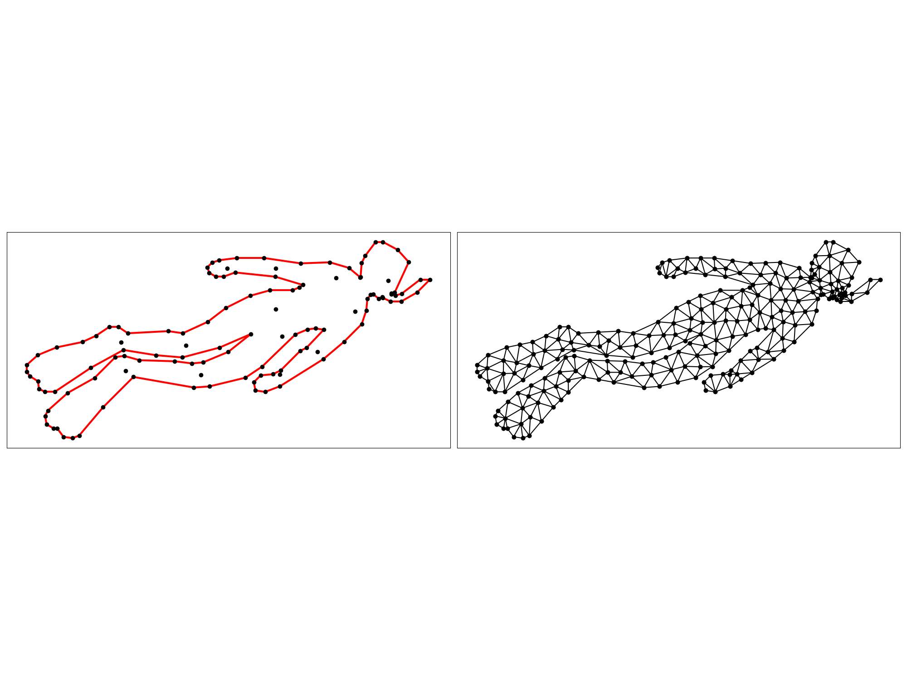
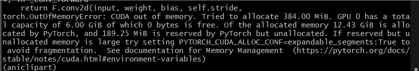
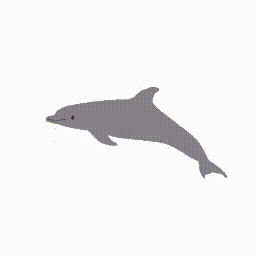
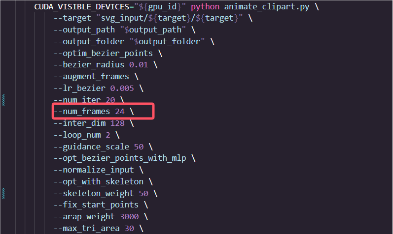
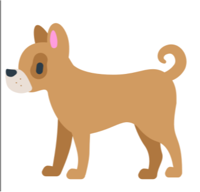
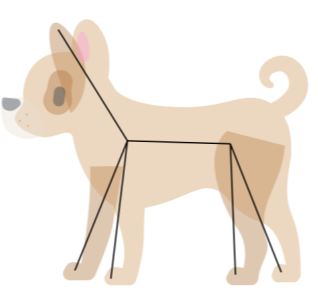
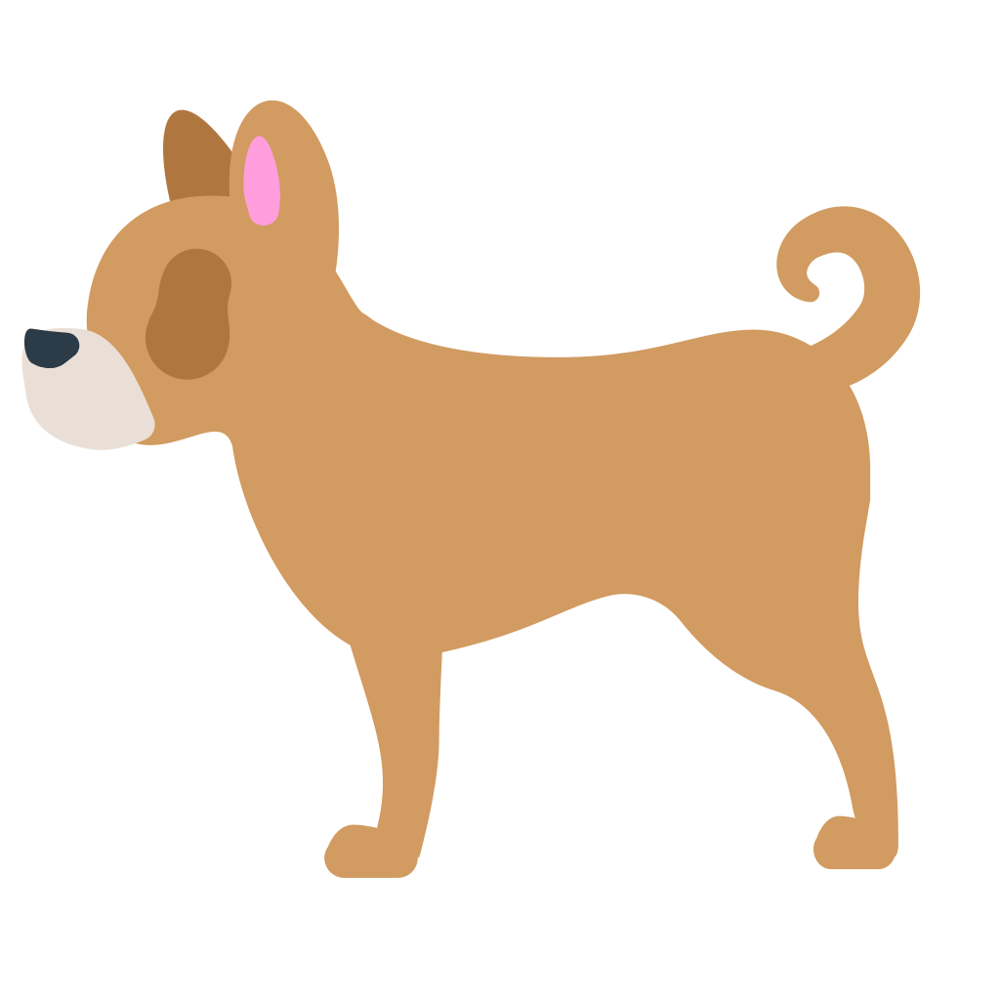
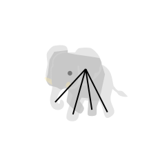

# AniClipart: Clipart Animation with Text-to-Video Priors 部署报告

孙志强

---

地址：[AniClipart: Clipart Animation with Text-to-Video Priors](https://aniclipart.github.io/)

仓库地址：[kingnobro/AniClipart: Code of "AniClipart: Clipart Animation with Text-to-Video Priors" (github.com)](https://github.com/kingnobro/AniClipart)

AniClipart项目旨在使用文本提示和机器学习技术为静态SVG（可缩放矢量图形）文件生成动画。以下是AniClipart的关键方面和目标：

**主要目标：**

1. **动画化静态SVG文件**：
   - 主要目标是将静态的SVG图像转换为动态动画，使静态图形变得生动起来，赋予它们运动和互动。
2. **文本提示集成**：
   - 用户可以提供文本提示来指导动画生成过程。这些提示帮助定义动画的类型或动画应传达的故事。
3. **机器学习和扩散模型**：
   - 项目使用机器学习模型，特别是扩散模型，来生成动画。这些模型解释文本提示并将适当的转换应用于SVG图像。

**关键技术：**

1. **Painter类和PainterOptimizer**：
   - Painter类定义了所有关于栅格化和曲线的内容，PainterOptimizer用于优化这些曲线。
2. **损失函数**：
   - 使用SDSVideoLoss和SkeletonLoss等损失函数来优化动画生成。
3. **数据增强**：
   - 通过各种图像增强技术来防止对抗性结果，使动画更自然。
4. **高效渲染和存储**：
   - 使用PyDiffVG库进行高效的SVG渲染，并将生成的动画保存为高质量的视频和GIF。

**工作流程：**

1. **解析参数**：
   - 通过argparse解析用户输入的参数，如目标SVG文件、文本提示、输出路径、模型名称等。
2. **初始化Painter和优化器**：
   - 创建Painter实例并初始化优化器，用于处理SVG文件并进行动画生成。
3. **渲染和优化**：
   - 渲染初始帧，并使用损失函数和优化器进行多次迭代，以生成最终的动画。
4. **保存结果**：
   - 将生成的动画保存为视频文件，并可选择上传到WandB进行结果追踪和可视化。

### 一、环境搭建（基于windows 11笔记本）

#### 1.1 使用Conda创建虚拟环境及安装VS2019

​		这里推荐使用conda3-py38的版本，一开始用的最新的conda3后面跑起来有点问题，也可能是我自己弄的环境太混乱了。

```bash
# （1）拷贝项目代码
git clone https://github.com/kingnobro/AniClipart.git
cd AniClipart
# （2）创建虚拟环境
conda create --name aniclipart python=3.8
conda activate aniclipart
#如果这里出问题，先conda init bash 初始化，再尝试一下
```

下一步是安装VS2019，我之前使用的VS2022,可能是太新了导致编译的过程中会出现问题，所以选择了比较旧的一个版本。

链接：https://pan.baidu.com/s/1D8eGWZwkRBoGyDiriWa-Hw?pwd=g790
提取码：g790
在安装的过程中只需选择使用C++的桌面开发即可，大概5-6GB.


#### 1.2 安装相关依赖

​		相关依赖在requirements.txt中给出，但是因为有版本冲突问题，我这里是自己单独下的。

这是我使用的基本环境

+ python3.8
+ torch2.3.0
+ cuda11.8
+ cudnn8.9.7

接下来安装requirements.txt中给出的依赖

```bash
# 激活你的conda环境
conda activate aniclipart

# 安装依赖项
pip install torch==2.3.0 -i http://mirrors.aliyun.com/pypi/simple --trusted-host mirrors.aliyun.com
pip install torchaudio==2.3.0 -i http://mirrors.aliyun.com/pypi/simple --trusted-host mirrors.aliyun.com
pip install torchvision==0.18.0 -i http://mirrors.aliyun.com/pypi/simple --trusted-host mirrors.aliyun.com
pip install ipywidgets -i http://mirrors.aliyun.com/pypi/simple --trusted-host mirrors.aliyun.com
pip install diffusers -i http://mirrors.aliyun.com/pypi/simple --trusted-host mirrors.aliyun.com
pip install easydict -i http://mirrors.aliyun.com/pypi/simple --trusted-host mirrors.aliyun.com
pip install cssutils -i http://mirrors.aliyun.com/pypi/simple --trusted-host mirrors.aliyun.com
pip install shapely -i http://mirrors.aliyun.com/pypi/simple --trusted-host mirrors.aliyun.com
pip install lightning -i http://mirrors.aliyun.com/pypi/simple --trusted-host mirrors.aliyun.com
pip install imageio==2.34.2 -i http://mirrors.aliyun.com/pypi/simple --trusted-host mirrors.aliyun.com
pip install imageio-ffmpeg==0.4.7 -i http://mirrors.aliyun.com/pypi/simple --trusted-host mirrors.aliyun.com
pip install scikit-image -i http://mirrors.aliyun.com/pypi/simple --trusted-host mirrors.aliyun.com
pip install wandb -i http://mirrors.aliyun.com/pypi/simple --trusted-host mirrors.aliyun.com
pip install moviepy -i http://mirrors.aliyun.com/pypi/simple --trusted-host mirrors.aliyun.com
pip install matplotlib -i http://mirrors.aliyun.com/pypi/simple --trusted-host mirrors.aliyun.com
pip install cairosvg -i http://mirrors.aliyun.com/pypi/simple --trusted-host mirrors.aliyun.com
pip install einops -i http://mirrors.aliyun.com/pypi/simple --trusted-host mirrors.aliyun.com
pip install transformers -i http://mirrors.aliyun.com/pypi/simple --trusted-host mirrors.aliyun.com
pip install accelerate -i http://mirrors.aliyun.com/pypi/simple --trusted-host mirrors.aliyun.com
pip install opencv-python -i http://mirrors.aliyun.com/pypi/simple --trusted-host mirrors.aliyun.com
pip install triangle -i http://mirrors.aliyun.com/pypi/simple --trusted-host mirrors.aliyun.com
pip install bezier -i http://mirrors.aliyun.com/pypi/simple --trusted-host mirrors.aliyun.com
```

#### 1.3 *安装Diffvg

​	这步是最容易出错误的，弄了两天一夜才搞定。

```bash
git clone https://github.com/BachiLi/diffvg.git
cd diffvg
```

注意这里的pybind11 和thrust里面是空的，最好自己在git下载好压缩包拷贝进去，我这里一开始使用了git submodule update --init --recursive这个命令，但是后面安装的时候就一直报错。


之后进行安装。

```
python setup.py install
```

如果出现问题File "G:\AniClipart\diffvg\setup.py", line 38, in build_extension    '-DPYTHON_LIBRARY=' + get_config_var('LIBDIR')

使用下面的setup.py，把其中的路径改成自己对应的即可。

```python
import os
import sys
import platform
import subprocess
import importlib
from sysconfig import get_paths

from setuptools import setup, Extension
from setuptools.command.build_ext import build_ext
from distutils.sysconfig import get_config_var

class CMakeExtension(Extension):
    def __init__(self, name, sourcedir, build_with_cuda):
        Extension.__init__(self, name, sources=[])
        self.sourcedir = os.path.abspath(sourcedir)
        self.build_with_cuda = build_with_cuda

class Build(build_ext):
    def run(self):
        try:
            subprocess.check_output(['cmake', '--version'])
        except OSError:
            raise RuntimeError("CMake must be installed to build the following extensions: " +
                               ", ".join(e.name for e in self.extensions))

        super().run()

    def build_extension(self, ext):
        if isinstance(ext, CMakeExtension):
            extdir = os.path.abspath(os.path.dirname(self.get_ext_fullpath(ext.name)))
            include_path = 'D:\\anaconda3\\envs\\aniclipart\\include'
            libdir = 'D:\\anaconda3\\envs\\aniclipart\\libs'

            cmake_args = ['-DCMAKE_LIBRARY_OUTPUT_DIRECTORY=' + extdir,
                          '-DPYTHON_LIBRARY=' + libdir,
                          '-DPYTHON_INCLUDE_PATH=' + include_path]

            cfg = 'Debug' if self.debug else 'Release'
            build_args = ['--config', cfg]

            if platform.system() == "Windows":
                cmake_args += ['-DCMAKE_LIBRARY_OUTPUT_DIRECTORY_{}={}'.format(cfg.upper(), extdir),
                               '-DCMAKE_RUNTIME_OUTPUT_DIRECTORY_{}={}'.format(cfg.upper(), extdir)]
                if sys.maxsize > 2**32:
                    cmake_args += ['-A', 'x64']
                build_args += ['--', '/m']
            else:
                cmake_args += ['-DCMAKE_BUILD_TYPE=' + cfg]
                build_args += ['--', '-j8']

            if ext.build_with_cuda:
                cmake_args += ['-DDIFFVG_CUDA=1']
            else:
                cmake_args += ['-DDIFFVG_CUDA=0']

            env = os.environ.copy()
            env['CXXFLAGS'] = '{} -DVERSION_INFO=\\"{}\\"'.format(env.get('CXXFLAGS', ''),
                                                                  self.distribution.get_version())
            if not os.path.exists(self.build_temp):
                os.makedirs(self.build_temp)
            subprocess.check_call(['cmake', ext.sourcedir] + cmake_args, cwd=self.build_temp, env=env)
            subprocess.check_call(['cmake', '--build', '.'] + build_args, cwd=self.build_temp)
        else:
            super().build_extension(ext)

torch_spec = importlib.util.find_spec("torch")
tf_spec = importlib.util.find_spec("tensorflow")
packages = []
build_with_cuda = False
if torch_spec is not None:
    packages.append('pydiffvg')
    import torch
    if torch.cuda.is_available():
        build_with_cuda = True
if tf_spec is not None and sys.platform != 'win32':
    packages.append('pydiffvg_tensorflow')
    if not build_with_cuda:
        import tensorflow as tf
        if tf.test.is_gpu_available():
            build_with_cuda = True

setup(
    name='pydiffvg',
    version='0.0.1',
    author='Wenzheng Chen',
    author_email='wenzchen@cs.toronto.edu',
    description='Differentiable Vector Graphics',
    long_description='',
    ext_modules=[CMakeExtension('pydiffvg', '.', build_with_cuda)],
    cmdclass=dict(build_ext=Build),
    zip_safe=False,
    packages=packages,
)
```

### 二、测试运行

#### 2.1 给定demo

**单层动画 (Single-layer animation)**:

```
bash scripts/run_aniclipart.sh
```

**多层动画 (Multi-layer animation)**:

```
bash scripts/run_layer_aniclipart.sh
```

因算力有限，我测试了单层动画给出的几个demo。

如下：

初始状态


栅格化和曲线化

|

|

最后效果:


其他的


#### 2.2 自制作贴图

（1）**使用picosvg简化**，PicoSVG是一个专门用于简化SVG图形的强大工具，通过一系列精心设计的转换规则，将任意SVG优化为“pico”版本，即更轻量级且结构更加整洁的格式。它确保每个SVG遵循严格的结构准则，从而提升图形在各种应用中的表现力和兼容性。

```shell
#格式化
picosvg shark_input.svg > shark.svg
```


（2）**Keypoint Detection**：生成其轮廓，并对轮廓进行简化，生成骨架和关键点。

```shell
#安装依赖
conda install -c conda-forge scikit-geometry
#运行 把target改成对应的名字
python -m preprocess.keypoint_detection
```


|

（3）格式化大小

```
#修改target
python -m preprocess.svg_resize
```


（4）添加描述

```
#打开 utils/util.py 文件，找到 get_clipart_caption 函数，查看 files_to_captions 字典的定义。
添加如下定义
'shark': 'A shark swimming in the ocean'
```

（5）开始生成

```bash
bash scripts/run_aniclipart.sh
```


由于显存只有6G，出现Out of memory.



其他效果





#### 2.3 参数影响

##### (1) num_frames=24     num_iter=5

由于显存有限，所以只使用CPU进行测试。

```bash
   --bezier_radius 0.01 \
        --augment_frames \
        --lr_bezier 0.005 \
        --num_iter 5 \
        --num_frames 24 \
        --inter_dim 128 \
        --loop_num 2 \
        --guidance_scale 50 \
        --opt_bezier_points_with_mlp \
        --normalize_input \
        --opt_with_skeleton \
        --skeleton_weight 25 \
        --fix_start_points \
        --arap_weight 3000 \
        --opt_with_layered_arap \
        --max_tri_area 30 \
        --min_tri_degree 20 \
        --need_subdivide
```

+ num_iter 调节运动范围，如果默认500，需要训练时间较久。
+ num_frames 生成图像的帧数


##### (2) num_frames=12     num_iter=5


##### (3) num_frames=24   num_iter=20

在贝塞尔曲线控制点不变的情况下，可以看出当num_iter次数增大，整体的动作幅度会随之增大，


### 三、使用AWS服务器部署

#### 3.1 服务器基本配置

+ 4vcpu、100G
+ g4dn-xlarge 16GB内存、1个NVIDIA T4 GPU
+ ubuntu 20.04
+ cuda 11.8

```bash
#安装依赖项
sudo apt install build-essential git wget
#安装conda
wget https://repo.anaconda.com/miniconda/Miniconda3-py38_22.11.1-1-Linux-x86_64.sh
Miniconda3-py38_22.11.1-1-Linux-x86_64.sh
source ~/.bashrc
```

+  安装CUDA


```bash
因为安装Cuda11.8需要gcc-9、g++-9,版本，ubuntu20.04直接安装的是gcc-13，如果安装gcc-8也不行，所以最终试下来是gcc-9
#1 安装gcc g++
conda install -c conda-forge gcc=9 gxx=9
或者
sudo apt-get install gcc-9 g++-9
#2 安装cmake
pip install cmake
# 安装N卡驱动
 lspci | grep -i nvidia #查看是否有gpu显卡
 ubuntu-drivers devices #自动检测你的显卡型号和推荐安装的驱动型号
 sudo ubuntu-drivers autoinstall #可以自动选择合适驱动版本安装
 sudo gedit ~/.bashrc #设置环境变量，写入下面两行
 export LD_LIBRARY_PATH=/usr/lib/x86_64-linux-gnu:$LD_LIBRARY_PATH
export LD_LIBRARY_PATH=/lib/x86_64-linux-gnu:$LD_LIBRARY_PATH
nvidia-smi #输入验证
#安装cuda
wget https://developer.download.nvidia.com/compute/cuda/11.8.0/local_installers/cuda_11.8.0_520.61.05_linux.run
sudo sh cuda_11.8.0_520.61.05_linux.run
#安装cudnn，一定要下载tar格式！
从NVIDIA官网的cudnn下载页面上下载与安装CUDA对应的cudnn，网址为https://developer.nvidia.com/rdp/cudnn-download。选择Ubuntu20.04系统下，CUDA11.8对应的版本，下载完后使用tar -zxvf解压
然后执行
sudo cp cudnn-linux-x86_64-8.9.0.131_cuda11-archive/include/cudnn*.h /usr/local/cuda/include
sudo cp cudnn-linux-x86_64-8.9.0.131_cuda11-archive/lib/libcudnn*  /usr/local/cuda/lib64/
sudo chmod a+r /usr/local/cuda/include/cudnn*.h /usr/local/cuda/lib64/libcudnn*
#输入验证cudnn
cat /usr/local/cuda-11.8/include/cudnn_version.h | grep CUDNN_MAJOR -A 2 
```


+  安装Aniclipart

```bash
#1 AniClipart
git clone https://github.com/kingnobro/AniClipart.git
cd AniClipart
#2 创建虚拟环境
conda create -n aniclipart python=3.8
conda activate aniclipart
#3 安装依赖项
pip install torch==2.3.0 
pip install torchaudio==2.3.0 
pip install torchvision==0.18.0 
pip install ipywidgets 
pip install diffusers 
pip install easydict 
pip install cssutils 
pip install shapely 
pip install lightning 
pip install imageio==2.34.2 
pip install imageio-ffmpeg==0.4.7 
pip install scikit-image 
pip install wandb 
pip install moviepy 
pip install matplotlib 
pip install cairosvg 
pip install einops 
pip install transformers 
pip install accelerate 
pip install opencv-python 
pip install triangle 
pip install bezier 
```

+  安装diffvg

```
git clone https://github.com/BachiLi/diffvg.git
cd diffvg
git submodule update --init --recursive
python setup.py install
```

中途可能遇到的问题

（1）  from /home/ubuntu/AniClipart/diffvg/diffvg.cpp:20: /home/ubuntu/miniconda3/envs/aniclipart/include/python3.8/Python.h:44:10: fatal error: crypt.h: No such file or directory   44 | #include <crypt.h>      |          ^~~~~~~~~ compilation terminated.

是因为在构建过程中缺少 `crypt.h` 头文件。`crypt.h` 是一个系统头文件，通常包含在 `libxcrypt-dev` 包中

```bash
#解决方案
sudo apt-get update
sudo apt-get install libc6-dev
conda install --channel=conda-forge libxcrypt
#拷贝到虚拟环境
cp /usr/include/crypt.h /home/ubuntu/miniconda/envs/anlicpart/include/python3.8/crypt.h
```


(2)CMake Error at CMakeLists.txt:3 (project):  The CMAKE_CXX_COMPILER:     /home/ubuntu/miniconda3/envs/aniclipart/bin/x86_64-conda-linux-gnu-c++   is not a full path to an existing compiler tool.   Tell CMake where to find the compiler by setting either the environment  variable "CXX" or the CMake cache entry CMAKE_CXX_COMPILER to the full path  to the compiler, or to the compiler name if it is in the PATH.

遇到这个问题一方面可能是CMake 无法找到指定的编译器路径。要确保 Conda 环境中的 GCC 9 路径正确，并且 CMake 能够识别这些路径。

有可能是gcc版本太多有冲突，要学会如何切换gcc、g++版本

```bash
#按数字选择版本
sudo update-alternatives --config gcc
sudo update-alternatives --config g++
```

也有可能是环境变量没有配置好

```bash
#编辑
vim ~/.bashrc
写入
export PATH=/usr/local/gcc-9.3.0/bin:$PATH
export LD_LIBRARY_PATH=/usr/local/gcc-9.3.0/lib64:$LD_LIBRARY_PATH
#重新加载
source ~/.bashrc
#验证
gcc --version
g++ --version
```

#### 3.2 运行测试

在此服务器配置下，iter500次耗时1.5h-2h。

```bash
#运行单层anilicpart
bash scripts/run_aniclipart.sh
```

测试中遇到的主要问题-CUDA out of memory


出现这个问题是显存不足的问题，通过查找资料

有如下解决方案：

（1）逐步调小PYTORCH_CUDA_ALLOC_CONF，但是会损失性能。

```bash
set PYTORCH_CUDA_ALLOC_CONF=max_split_size_mb:16
```

调了好几次，没有效果

（2）不累加loss及 `torch.cuda.empty_cache()` 手动清理 失活内存

我在for循环每次迭代后面使用了torch.cuda.empty_cache()，但是依然不行

（2）需要调整模型大小及精度



这里必须要牺牲帧数去换取空间，我尝试了几个帧数24、20、18、16、12。

num_frames=12最终可以成功跑起来，虽然出来的动作会不太流畅，但是能在显存16G的情况下跑起来。

论文中使用的n NVIDIA RTX A6000  26GB，能轻松跑起来24帧数的，且迭代500次只需要30分钟。

通过这次，谈谈对out of memory的认识：

对于CUDA运行时，其固件会占用一定的显存，不同的CUDA版本或显卡型号固件显存不同。换言之，只要使用了GPU，就至少会占x xx M的显存，且这部分显存无法被释放。CUDA内存管理机制在使用显存时，将内存分为激活内存和失活内存两种状态，并通过一种类似队列的方式进行管理。

1. **激活内存（Activate Memory）**：
   - 这部分内存当前正被变量或数据所引用，处于活跃使用状态。
   - 当需要进行计算或处理时，CUDA会将数据加载到激活内存中。
2. **失活内存（Unactivate Memory）**：
   - 当一块内存不再被任何变量所引用时，它会从激活内存转为失活内存。
   - 失活内存仍然存在于CUDA的内存队列中，但暂时不被使用。

当新的数据需要被加载到显存时，CUDA会按照以下步骤处理内存：

1. **检查失活内存**：
   - CUDA会首先检查失活内存，看看是否有足够的空间来存放新的数据。
2. **释放失活内存**：
   - 如果失活内存中的空间足够，CUDA会将这部分内存释放出来用于存放新的数据。
3. **显存扩展**：
   - 如果失活内存中的空间不足，CUDA会从显存中申请更多的空间来存放新的数据。这相当于扩展了队列的容量。

所以（1）GPU显存占用率和存入的数据尺寸成正相关，越大的数据占用显存越多；（2）只要使用了GPU，就至少会占x xx M的显存，且这部分显存无法被释放；（3）当一块内存不再被变量所引用时，这块内存就由激活内存转为失活内存，但它仍然存在于这个数据队列中；（4）当数据队列达到某个阈值时，CUDA会触发垃圾回收机制，清理失活内存（5）运行torch.cuda.empty_cache()可以手动清理失活内存


原文链接：https://blog.csdn.net/frigidwinter/article/details/130033162

#### 3.3测试结果

(1)使用原有的woman_dance进行50次iter和500次对比

caption：caption: A woman in a green dress with black polka dots and black boots is dancing
  joyfully.

|||

（2）自制作贴图

+ dog

caption："dog": "A dog is running."

|||

tier500次后的结果：



​	从这个结果分析来看，有可能是贴图找的不太合适，导致在处理帧的时候将dog的eye和其中另一边的legs都去掉了，但是最终来看，dog的运动轨迹还是比较贴切的。

+ shark

caption:'shark': 'A shark swimming in the ocean'

||


+ chicken

caption:"chicken": "A chicken is jumping up and down."

||


+ elephant

caption:"elephant": "An elephant jumps and wags its trunk up and down continuously.",

|||


+  多层动画生成


### 3.4 自制多layer 

在此之前，要先了解svg的path相关的知识，也为进一步了解打下基础。

在 SVG（Scalable Vector Graphics）中，`<path>` 元素是一种非常强大和灵活的图形元素，用于绘制复杂的形状和路径。它可以用来创建各种图形，如直线、曲线、多边形等。

`path` 元素的基本结构

```
html
复制代码
<path d="指令和参数" />
```

- **`d` 属性**：`d` 属性包含一系列的绘图指令和参数，用于描述路径的形状和曲线。

常见的绘图指令

- **M** (Move To)：移动到指定的坐标位置，不绘制线条。例如，`M 10 10` 将当前位置移动到 (10, 10)。
- **L** (Line To)：从当前点绘制一条直线到指定坐标。例如，`L 50 50` 从当前点绘制一条直线到 (50, 50)。
- **H** (Horizontal Line To)：绘制一条水平直线。例如，`H 100` 从当前位置绘制一条水平直线到 x = 100。
- **V** (Vertical Line To)：绘制一条垂直直线。例如，`V 100` 从当前位置绘制一条垂直直线到 y = 100。
- **C** (Cubic Bezier Curve)：绘制一条三次贝塞尔曲线。例如，`C 20 20, 40 40, 60 60` 从当前位置绘制一条贝塞尔曲线，控制点为 (20, 20) 和 (40, 40)，终点为 (60, 60)。
- **S** (Smooth Cubic Bezier Curve)：绘制平滑的三次贝塞尔曲线。它会使用前一个曲线的结束点作为起始控制点。
- **Q** (Quadratic Bezier Curve)：绘制一条二次贝塞尔曲线。例如，`Q 30 30, 60 60` 从当前位置绘制一条二次贝塞尔曲线，控制点为 (30, 30)，终点为 (60, 60)。
- **T** (Smooth Quadratic Bezier Curve)：绘制平滑的二次贝塞尔曲线。它会使用前一个曲线的结束点作为起始控制点。
- **A** (Arc To)：绘制弧线。`A rx ry x-axis-rotation large-arc-flag sweep-flag x y`，其中 `rx` 和 `ry` 是弧的半径，`x-axis-rotation` 是弧的旋转角度，`large-arc-flag` 和 `sweep-flag` 用于控制弧的方向。
- **Z** (Close Path)：闭合路径，将路径的最后一点连接到起始点。

示例

下面是一个简单的例子，演示如何使用 `path` 元素绘制一个矩形和一个圆弧：

```html
html复制代码<svg width="200" height="200" xmlns="http://www.w3.org/2000/svg">
  <!-- 绘制一个矩形 -->
  <path d="M10 10 H 90 V 90 H 10 Z" fill="none" stroke="black" />
  <!-- 绘制一个圆弧 -->
  <path d="M150 150 A 40 40 0 0 1 190 150 A 40 40 0 0 1 150 150" fill="none" stroke="black" />
</svg>
```

- 矩形：`M10 10 H 90 V 90 H 10 Z` 描述了一个矩形，从 (10, 10) 开始，绘制到 (90, 10)，然后到 (90, 90)，再到 (10, 90)，最后闭合路径。
- 圆弧：`M150 150 A 40 40 0 0 1 190 150 A 40 40 0 0 1 150 150` 描述了一个半径为 40 的圆弧，从 (150, 150) 绘制到 (190, 150)，再到 (150, 150)，形成一个完整的圆弧。


以camel为例子，关键点序号如下：

```xml
<svg xmlns="http://www.w3.org/2000/svg" viewBox="0.0 0.0 256.0 256.0" height="256.0px" width="256.0px">
    <circle fill="black" fill-opacity="1.0" cx="122.35879516601562" cy="97.8919906616211" r="4.400000095367432"/>
    <text x="127.35879516601562" y="97.8919906616211" font-family="Verdana" font-size="10" fill="red">1</text>
    <circle fill="black" fill-opacity="1.0" cx="192.0" cy="147.56674194335938" r="4.400000095367432"/>
    <text x="197.0" y="147.56674194335938" font-family="Verdana" font-size="10" fill="red">2</text>
    <circle fill="black" fill-opacity="1.0" cx="61.89299774169922" cy="74.44351196289062" r="4.400000095367432"/>
    <text x="66.89299774169922" y="74.44351196289062" font-family="Verdana" font-size="10" fill="red">3</text>
    <circle fill="black" fill-opacity="1.0" cx="168.72508239746094" cy="143.88522338867188" r="4.400000095367432"/>
    <text x="173.72508239746094" y="143.88522338867188" font-family="Verdana" font-size="10" fill="red">4</text>
    <circle fill="black" fill-opacity="1.0" cx="159.25396728515625" cy="108.78765869140625" r="4.400000095367432"/>
    <text x="164.25396728515625" y="108.78765869140625" font-family="Verdana" font-size="10" fill="red">5</text>
    <circle fill="black" fill-opacity="1.0" cx="87.239990234375" cy="154.22113037109375" r="4.400000095367432"/>
    <text x="92.239990234375" y="154.22113037109375" font-family="Verdana" font-size="10" fill="red">6</text>
    <circle fill="black" fill-opacity="1.0" cx="109.62373352050781" cy="127.60652160644531" r="4.400000095367432"/>
    <text x="114.62373352050781" y="127.60652160644531" font-family="Verdana" font-size="10" fill="red">7</text>
</svg>

```


camel的path如下：

path1:

```
<path fill="#d3883e" fill-opacity="1.0"  filling="0" d="M106.72000122070312 144.0 L111.52000427246094 144.0 L116.32000732421875 144.0 L121.12001037597656 144.0 L125.92000579833984 144.0 L130.72000122070312 144.0 L131.7572021484375 148.67840576171875 L132.79440307617188 153.35679626464844 L133.83160400390625 158.0352020263672 L134.86880493164062 162.71360778808594 L135.906005859375 167.39199829101562 L136.94320678710938 172.07040405273438 L137.9803924560547 176.74879455566406 L139.01760864257812 181.4272003173828 L140.0548095703125 186.1055908203125 L141.09201049804688 190.78399658203125 L142.12921142578125 195.46240234375 L143.16641235351562 200.14080810546875 L144.20359802246094 204.81918334960938 L145.24081420898438 209.49758911132812 L146.27801513671875 214.17599487304688 L147.31520080566406 218.85440063476562 L148.35240173339844 223.53280639648438 L149.3896026611328 228.211181640625 L150.4268035888672 232.88958740234375 L151.46400451660156 237.5679931640625 C151.73599243164062 238.8159942626953 150.78399658203125 240.0 149.51199340820312 240.0 L144.53599548339844 240.0 L139.55999755859375 240.0 L134.58399963378906 240.0 L129.60800170898438 240.0 C128.6719970703125 240.0 127.85600280761719 239.3520050048828 127.65599822998047 238.4320068359375 L126.60919189453125 233.7104034423828 L125.56239318847656 228.98880004882812 L124.5156021118164 224.2672119140625 L123.46880340576172 219.5456085205078 L122.4219970703125 214.82400512695312 L121.37519836425781 210.10240173339844 L120.32839965820312 205.38079833984375 L119.28160095214844 200.65921020507812 L118.23480224609375 195.93759155273438 L117.18800354003906 191.21600341796875 L116.14120483398438 186.49441528320312 L115.09440612792969 181.77279663085938 L114.04759216308594 177.05120849609375 L113.00080871582031 172.32958984375 L111.9540023803711 167.60800170898438 L110.90719604492188 162.88641357421875 L109.86040496826172 158.164794921875 L108.8135986328125 153.4431915283203 L107.76679992675781 148.7216033935547 L106.72000122070312 144.0"></path>
```


path2:

```
<path fill="#d3883e" fill-opacity="1.0"  filling="0" d="M203.0399932861328 154.16000366210938 L198.239990234375 154.16000366210938 L193.44000244140625 154.16000366210938 L188.63999938964844 154.16000366210938 L183.83999633789062 154.16000366210938 L179.0399932861328 154.16000366210938 L178.01199340820312 158.7937774658203 L176.9840087890625 163.42755126953125 L175.95599365234375 168.0613250732422 L174.92799377441406 172.6951141357422 L173.89999389648438 177.32888793945312 L172.87200927734375 181.96267700195312 L171.843994140625 186.59645080566406 L170.81600952148438 191.230224609375 L169.78799438476562 195.86399841308594 L168.760009765625 200.49777221679688 L167.73199462890625 205.1315460205078 L166.70401000976562 209.7653350830078 L165.67599487304688 214.3990936279297 L164.64801025390625 219.03289794921875 L163.6199951171875 223.66665649414062 L162.59201049804688 228.30044555664062 L161.56399536132812 232.9342041015625 L160.53599548339844 237.5679931640625 C160.26400756835938 238.8159942626953 161.21600341796875 240.0 162.48800659179688 240.0 L167.46400451660156 240.0 L172.44000244140625 240.0 L177.416015625 240.0 L182.39199829101562 240.0 C183.33599853515625 240.0 184.1439971923828 239.3520050048828 184.343994140625 238.4320068359375 L185.38265991210938 233.75021362304688 L186.42132568359375 229.06845092773438 L187.45999145507812 224.38665771484375 L188.4986572265625 219.70489501953125 L189.53732299804688 215.0231170654297 L190.57598876953125 210.3413543701172 L191.61465454101562 205.65956115722656 L192.65333557128906 200.977783203125 L193.69198608398438 196.29600524902344 L194.7306671142578 191.61422729492188 L195.76931762695312 186.9324493408203 L196.80799865722656 182.25067138671875 L197.84666442871094 177.5688934326172 L198.8853302001953 172.88711547851562 L199.9239959716797 168.205322265625 L200.96266174316406 163.5235595703125 L202.00132751464844 158.84176635742188 L203.0399932861328 154.16000366210938"></path>
```


path3:

```xml
<path fill="#f3ad61" fill-opacity="1.0"  filling="0" d="M240.0 98.0 C239.9199981689453 96.63999938964844 239.27999877929688 95.27999877929688 238.32000732421875 94.31999969482422 C238.30154418945312 94.3015365600586 238.04734802246094 94.0302963256836 237.59349060058594 93.5449447631836 C237.13963317871094 93.0595932006836 236.4861297607422 92.3601303100586 235.66905212402344 91.4852294921875 C234.8519744873047 90.6103286743164 233.87132263183594 89.55998229980469 232.76319885253906 88.37287902832031 C231.6550750732422 87.1857681274414 230.41944885253906 85.86189270019531 229.0924530029297 84.43991088867188 C227.76544189453125 83.01793670654297 226.34703063964844 81.49786376953125 224.87332153320312 79.91836547851562 C223.39959716796875 78.3388671875 221.87057495117188 76.69993591308594 220.3223114013672 75.0402603149414 C218.7740478515625 73.38057708740234 217.20657348632812 71.70014190673828 215.65594482421875 70.0376205444336 C214.10531616210938 68.3750991821289 212.57156372070312 66.7304916381836 211.0907440185547 65.14247131347656 C209.60992431640625 63.55445098876953 208.1820526123047 62.023014068603516 206.84320068359375 60.58683776855469 C205.50436401367188 59.150657653808594 204.25454711914062 57.80973815917969 203.1298370361328 56.60274887084961 C202.00514221191406 55.395755767822266 201.00555419921875 54.32269287109375 200.16717529296875 53.4222297668457 C199.32879638671875 52.521766662597656 198.651611328125 51.79389953613281 198.17172241210938 51.277305603027344 C197.69183349609375 50.760711669921875 197.40924072265625 50.45538330078125 197.36000061035156 50.400001525878906 C196.26666259765625 49.31999969482422 195.10667419433594 48.31111145019531 193.8870391845703 47.37963104248047 C192.6674041748047 46.448150634765625 191.38815307617188 45.59407424926758 190.05630493164062 44.82370376586914 C188.72445678710938 44.0533332824707 187.3400115966797 43.36666488647461 185.91000366210938 42.77000045776367 C184.48001098632812 42.17333221435547 183.00445556640625 41.66666793823242 181.49037170410156 41.25629806518555 C179.97628784179688 40.845924377441406 178.4237060546875 40.53185272216797 176.83963012695312 40.320369720458984 C175.25555419921875 40.10888671875 173.63999938964844 40.0 172.0 40.0 C170.35000610351562 40.0 168.72625732421875 40.11125183105469 167.1357879638672 40.326560974121094 C165.54531860351562 40.541873931884766 163.98812866210938 40.86124801635742 162.47125244140625 41.277496337890625 C160.95437622070312 41.693748474121094 159.47781372070312 42.206871032714844 158.04859924316406 42.80968475341797 C156.619384765625 43.412498474121094 155.2375030517578 44.10499572753906 153.91000366210938 44.87999725341797 C152.58250427246094 45.654998779296875 151.3093719482422 46.51249694824219 150.09765625 47.445308685302734 C148.8859405517578 48.37812042236328 147.73562622070312 49.38624572753906 146.65374755859375 50.462493896484375 C145.57186889648438 51.53874206542969 144.55844116210938 52.68312072753906 143.62046813964844 53.88843536376953 C142.6824951171875 55.093746185302734 141.82000732421875 56.36000061035156 141.0399932861328 57.68000030517578 C141.0399932861328 57.68000030517578 140.79734802246094 58.03041458129883 140.3560028076172 58.66782760620117 C139.91464233398438 59.30524444580078 139.2745819091797 60.22966003417969 138.47975158691406 61.37767028808594 C137.68492126464844 62.52568054199219 136.73532104492188 63.897281646728516 135.6748809814453 65.42906188964844 C134.61444091796875 66.96084594726562 133.44317626953125 68.65280151367188 132.20501708984375 70.44153594970703 C130.96685791015625 72.23026275634766 129.6617889404297 74.11576843261719 128.33375549316406 76.03462219238281 C127.00572967529297 77.95347595214844 125.65474700927734 79.90569305419922 124.32473754882812 81.8278579711914 C122.9947280883789 83.7500228881836 121.68569946289062 85.64213562011719 120.44158172607422 87.44078063964844 C119.19746398925781 89.23942565917969 118.01826477050781 90.94461059570312 116.94791412353516 92.492919921875 C115.8775634765625 94.04122924804688 114.91606140136719 95.43266296386719 114.10734558105469 96.60381317138672 C113.29862976074219 97.77496337890625 112.6427001953125 98.725830078125 112.18350219726562 99.39299774169922 C111.72429656982422 100.06016540527344 111.46182250976562 100.44363403320312 111.44000244140625 100.4800033569336 C110.72000122070312 101.63999938964844 109.72000122070312 102.60000610351562 108.54000091552734 103.27000427246094 C107.36000061035156 103.94000244140625 106.0 104.31999969482422 104.55999755859375 104.31999969482422 C103.09333038330078 104.2933349609375 101.72444152832031 103.85778045654297 100.55110931396484 103.12592315673828 C99.37777709960938 102.39407348632812 98.4000015258789 101.36592864990234 97.7155532836914 100.1540756225586 C97.03111267089844 98.94222259521484 96.63999938964844 97.54666900634766 96.63999938964844 96.08000183105469 L96.586669921875 91.40666961669922 L96.53333282470703 86.73332977294922 L96.47999572753906 82.05999755859375 L96.42666625976562 77.38667297363281 L96.37332916259766 72.71333312988281 L96.31999969482422 68.04000091552734 L96.26666259765625 63.36666488647461 L96.21333312988281 58.693336486816406 L96.16000366210938 54.02000045776367 L96.1066665649414 49.34666442871094 L96.05332946777344 44.673336029052734 L96.0 40.0 L96.0 35.38666915893555 L96.0 30.77333641052246 L96.0 26.160003662109375 C96.0 24.959999084472656 94.95999908447266 24.0 93.76000213623047 24.0 C92.24000549316406 24.0 90.77760314941406 24.246400833129883 89.41056060791016 24.70207977294922 C88.04351806640625 25.157760620117188 86.77184295654297 25.82271957397461 85.63328552246094 26.659841537475586 C84.4947280883789 27.49696159362793 83.48928833007812 28.506240844726562 82.65472412109375 29.650562286376953 C81.82015991210938 30.79488182067871 81.15647888183594 32.074241638183594 80.7014389038086 33.45152282714844 C80.24639892578125 34.828800201416016 80.0 36.30400085449219 80.0 37.839996337890625 C80.0 39.040000915527344 78.95999908447266 40.0 77.76000213623047 40.0 L72.94857025146484 40.0 L68.13714599609375 40.0 L63.32571792602539 40.0 L58.51428985595703 40.0 L53.702857971191406 40.0 L48.89143371582031 40.0 L44.08000183105469 40.0 C42.35555648803711 40.0 40.66765594482422 40.155059814453125 39.02946472167969 40.4520149230957 C37.391273498535156 40.74897003173828 35.802799224853516 41.18781661987305 34.27720260620117 41.75539016723633 C32.75160598754883 42.32296371459961 31.288888931274414 43.019256591796875 29.9022216796875 43.831111907958984 C28.515554428100586 44.64296340942383 27.204936981201172 45.570369720458984 25.983537673950195 46.60016632080078 C24.76213836669922 47.62995910644531 23.62995719909668 48.762142181396484 22.600162506103516 49.98353958129883 C21.57036781311035 51.20494079589844 20.642961502075195 52.51555633544922 19.83111000061035 53.9022216796875 C19.019258499145508 55.28889083862305 18.322961807250977 56.75160598754883 17.755390167236328 58.27720260620117 C17.18781852722168 59.80280303955078 16.74897003173828 61.39127731323242 16.452016830444336 63.02946853637695 C16.155061721801758 64.66765594482422 16.0 66.35556030273438 16.0 68.08000183105469 L16.0 71.04000091552734 C16.0 72.6933364868164 16.44444465637207 74.23999786376953 17.220741271972656 75.5674057006836 C17.99703598022461 76.89481353759766 19.10518455505371 78.00296020507812 20.432592391967773 78.77925872802734 C21.760000228881836 79.55555725097656 23.30666732788086 80.0 24.959999084472656 80.0 L29.663999557495117 80.0 L34.36799621582031 80.0 L39.071998596191406 80.0 L43.775997161865234 80.0 L48.47999572753906 80.0 C49.86666488647461 80.0 51.16444396972656 80.37333679199219 52.27851867675781 81.02518463134766 C53.39259338378906 81.67703247070312 54.32296371459961 82.60740661621094 54.974815368652344 83.72148132324219 C55.62666702270508 84.83555603027344 56.0 86.13333129882812 56.0 87.5199966430664 L56.0 92.12799835205078 L56.0 96.73600006103516 L56.0 101.343994140625 L56.0 105.95199584960938 L56.0 110.55999755859375 C56.0 112.20307159423828 56.06958770751953 113.83052825927734 56.205955505371094 115.43955993652344 C56.342323303222656 117.04859161376953 56.54547119140625 118.63919830322266 56.812599182128906 120.20857238769531 C57.07972717285156 121.77794647216797 57.410831451416016 123.32609558105469 57.8031120300293 124.85021209716797 C58.19539260864258 126.37432861328125 58.64884567260742 127.87440490722656 59.16067123413086 129.34765625 C59.6724967956543 130.82090759277344 60.24269104003906 132.26730346679688 60.86845397949219 133.68408203125 C61.49421691894531 135.10084533691406 62.17554473876953 136.48797607421875 62.909637451171875 137.8426513671875 C63.64373016357422 139.1973419189453 64.43058776855469 140.5195770263672 65.26740264892578 141.8065643310547 C66.10421752929688 143.0935516357422 66.9909896850586 144.34530639648438 67.92491912841797 145.55899047851562 C68.85884857177734 146.77268981933594 69.83992767333984 147.9483184814453 70.86536407470703 149.08311462402344 C71.89080047607422 150.2178955078125 72.96058654785156 151.31182861328125 74.07191467285156 152.36209106445312 C75.1832504272461 153.41236877441406 76.33613586425781 154.41897583007812 77.52775573730469 155.37911987304688 C78.7193832397461 156.33926391601562 79.94975280761719 157.25294494628906 81.216064453125 158.1173553466797 C82.48236846923828 158.98178100585938 83.78462219238281 159.7969207763672 85.12000274658203 160.55999755859375 C86.0 161.04000854492188 86.72000122070312 161.74000549316406 87.22000122070312 162.5800018310547 C87.72000122070312 163.4199981689453 88.0 164.39999389648438 88.0 165.44000244140625 L88.0 170.14401245117188 L88.0 174.84800720214844 L88.0 179.552001953125 L88.0 184.25601196289062 L88.0 188.9600067138672 L88.0 193.66400146484375 L88.0 198.36801147460938 L88.0 203.072021484375 L88.0 207.7760009765625 L88.0 212.48001098632812 L88.0 217.1840057373047 L88.0 221.88800048828125 L88.0 226.59201049804688 L88.0 231.29598999023438 L88.0 236.0 C88.0 237.1199951171875 88.44000244140625 238.1199951171875 89.16000366210938 238.83999633789062 C89.8800048828125 239.55999755859375 90.8800048828125 240.0 92.0 240.0 L96.0 240.0 L100.0 240.0 L104.0 240.0 L108.0 240.0 C109.1199951171875 240.0 110.1199951171875 239.55999755859375 110.83999633789062 238.83999633789062 C111.55999755859375 238.1199951171875 112.0 237.1199951171875 112.0 236.0 L112.0 231.14285278320312 L112.0 226.2857208251953 L112.0 221.42857360839844 L112.0 216.57142639160156 L112.0 211.7142791748047 L112.0 206.85714721679688 L112.0 202.0 L112.0 197.1428680419922 L112.0 192.28570556640625 L112.0 187.42857360839844 L112.0 182.57142639160156 L112.0 177.71429443359375 L112.0 172.85714721679688 L112.0 168.0 L116.9230728149414 168.0 L121.84616088867188 168.00001525878906 L126.76922607421875 168.0 L131.69232177734375 168.0 L136.61538696289062 168.0 L141.5384521484375 168.0 L146.4615478515625 168.0 L151.38461303710938 168.0 L156.30770874023438 168.0 L161.23077392578125 168.0 L166.1538543701172 168.00001525878906 L171.07691955566406 168.0 L176.0 168.0 C177.55999755859375 168.0 179.09500122070312 167.91000366210938 180.60250854492188 167.7362518310547 C182.11000061035156 167.5625 183.58999633789062 167.30499267578125 185.04000854492188 166.97000122070312 C186.49000549316406 166.635009765625 187.91000366210938 166.22250366210938 189.29750061035156 165.73875427246094 C190.68499755859375 165.2550048828125 192.04000854492188 164.70001220703125 193.36000061035156 164.0800018310547 C193.6320037841797 165.48800659179688 193.93919372558594 166.8863983154297 194.28224182128906 168.27392578125 C194.62527465820312 169.66143798828125 195.00416564941406 171.0380859375 195.41952514648438 172.40255737304688 C195.8348846435547 173.76702880859375 196.28672790527344 175.11935424804688 196.7756805419922 176.45823669433594 C197.2646484375 177.797119140625 197.7907257080078 179.12255859375 198.3545684814453 180.4332733154297 C198.91839599609375 181.74398803710938 199.52000427246094 183.04000854492188 200.16000366210938 184.32000732421875 L201.86000061035156 187.74000549316406 L203.55999755859375 191.16000366210938 L205.260009765625 194.5800018310547 L206.9600067138672 198.0 C207.67999267578125 199.27999877929688 208.0 200.8000030517578 208.0 202.24000549316406 L208.0 207.0628662109375 L208.0 211.88572692871094 L208.0 216.70858764648438 L208.0 221.53143310546875 L208.0 226.35427856445312 L208.0 231.17715454101562 L208.0 236.0 C208.0 237.1199951171875 208.44000244140625 238.1199951171875 209.16000366210938 238.83999633789062 C209.8800048828125 239.55999755859375 210.8800048828125 240.0 212.0 240.0 L216.0 240.0 L220.0 240.0 L224.0 240.0 L228.0 240.0 C229.1199951171875 240.0 230.1199951171875 239.55999755859375 230.83999633789062 238.83999633789062 C231.55999755859375 238.1199951171875 232.0 237.1199951171875 232.0 236.0 L232.0 231.0933380126953 L231.99998474121094 226.18666076660156 L232.0 221.28001403808594 L232.0 216.37335205078125 L232.0 211.46665954589844 L232.0 206.55999755859375 L232.0 201.6533203125 L232.0 196.7466583251953 L232.0 191.8400115966797 L232.0 186.93331909179688 L232.0 182.02667236328125 L232.00001525878906 177.1199951171875 L232.0 172.2133331298828 L232.0 167.30667114257812 L232.00001525878906 162.40000915527344 L232.0 157.4933319091797 L232.0 152.58665466308594 L232.0 147.6800079345703 L232.0 142.77333068847656 L232.0 137.8666534423828 L232.0 132.9600067138672 L232.0 128.05332946777344 L232.0 123.14666748046875 L232.0 118.23999786376953 L231.99998474121094 113.33332824707031 L232.0 108.42666625976562 L232.0 103.5199966430664 C233.1999969482422 104.07999420166016 234.51556396484375 104.15999603271484 235.7274169921875 103.84888458251953 C236.93927001953125 103.53777313232422 238.04742431640625 102.83555603027344 238.8325958251953 101.83110809326172 C239.61778259277344 100.82666778564453 240.0800018310547 99.52000427246094 240.0 98.0"></path>
```


path4:

```xml
<path fill="#1c1c1c" fill-opacity="1.0"  filling="0" d="M60.0 67.04000091552734 C58.87999725341797 67.04000091552734 57.87999725341797 66.58000183105469 57.159996032714844 65.8499984741211 C56.439998626708984 65.1199951171875 56.0 64.1199951171875 56.0 63.040000915527344 L56.0 59.52000045776367 L56.0 56.0 C56.0 54.87999725341797 56.439998626708984 53.87999725341797 57.159996032714844 53.159996032714844 C57.87999725341797 52.439998626708984 58.87999725341797 52.0 60.0 52.0 C61.12000274658203 52.0 62.12000274658203 52.439998626708984 62.840003967285156 53.159996032714844 C63.560001373291016 53.87999725341797 64.0 54.87999725341797 64.0 56.0 L64.0 59.52000045776367 L64.0 63.040000915527344 C64.0 64.1199951171875 63.560001373291016 65.1199951171875 62.840003967285156 65.8499984741211 C62.12000274658203 66.58000183105469 61.12000274658203 67.04000091552734 60.0 67.04000091552734"></path>
```


path5:

```xml
<path fill="#d3883e" fill-opacity="1.0"  filling="0" d="M28.0 74.08000183105469 C26.880001068115234 74.08000183105469 25.880001068115234 73.62000274658203 25.15999984741211 72.88999938964844 C24.440000534057617 72.16000366210938 24.0 71.16000366210938 24.0 70.08000183105469 L24.0 66.55999755859375 C24.0 65.44000244140625 24.440000534057617 64.44000244140625 25.15999984741211 63.71999740600586 C25.880001068115234 63.0 26.880001068115234 62.55999755859375 28.0 62.55999755859375 C29.119998931884766 62.55999755859375 30.119998931884766 63.0 30.84000015258789 63.71999740600586 C31.559999465942383 64.44000244140625 32.0 65.44000244140625 32.0 66.55999755859375 L32.0 70.08000183105469 C32.0 71.16000366210938 31.559999465942383 72.16000366210938 30.84000015258789 72.88999938964844 C30.119998931884766 73.62000274658203 29.119998931884766 74.08000183105469 28.0 74.08000183105469"></path></svg>
```


然后根据生成的keypoint和想要放到一起的图层来攥写camel_layer.json


```json
[
  {
    "path_index": [
     2
    ],
    "layer": "layer_0",
    "control_index": [6,7]
  },
  {
    "path_index": [
      5,
      4,
      3
    ],
    "layer": "layer_1",
    "control_index": [1,2,3,5]
  },
  {
    "path_index": [
    1
    ],
    "layer": "layer_2",
    "control_index": [2,4]
  }
]

```

这里分为了3层，将两只后面的图分别单独作为一层。

### 四、常见问题

（1）LINK : fatal error LNK1104:  “python38.lib”

在build文件夹内新建一个名为Directory.Build.props的文件。指向自己conda环境的python38.lib所在文件夹。可用软件everything搜索。

```xml
<Project>
 <ItemDefinitionGroup>
 <Link>
 <AdditionalLibraryDirectories>C:\XXXXXX\Python38\libs;%(AdditionalLibraryDirectories)</AdditionalLibraryDirectories>
 </Link>
 </ItemDefinitionGroup>
</Project>
```

（2）ModuleNotFoundError: No module named 'diffvg'

在conda环境文件夹中找到diffvg-0.0.1-py3.8-win-amd64.egg。可用软件everything搜索。


（3）   import diffvg ImportError: DLL load failed while importing diffvg: ▒Ҳ▒▒▒ָ▒▒▒▒ģ▒顣

这种问题说是DLL loadfailed，我下载了Dependencies去查看这个的依赖。


​		发现我明明是在conda3.8环境下安装的，为什么会出现这种情况。有可能是我conda的版本太新了也有可能是我的环境太混乱了，所以我把conda删掉了，重新下了一个旧一点的，这次再查看就没问题了，之前试过了很多方法都没有用。

（4）对于出现的其他情况


像这种之类的，在aniclipart仓库里面的issue有些可能会有。其他的按照这个步骤来应该都没什么问题。 

(5)安装了CUDA 、pytorch之后无法调用GPU

直接在终端里pip install torch torchvision torchaudio的版本是适用于只有CPU的，所以是无法调用的，从官网里面的[PyTorch](https://pytorch.org/)安装。如果遇到网络超时直接点对应的链接，下载对应的版本到本地再安装

```
pip3 install torch torchvision torchaudio --index-url https://download.pytorch.org/whl/cu118
```


### 五、相关链接

在部署aniclipart的过程中遇到了很多问题，非常感谢github社区及CSDN上创作者门的帮助。以下是一些链接。

[CUDA安装及环境配置——最新详细版-CSDN博客](https://blog.csdn.net/chen565884393/article/details/127905428)

[win10，python，安装diffvg - 知乎 (zhihu.com)](https://zhuanlan.zhihu.com/p/560277508)

[Compile diffvg sucess on Windows, give you wheel · Issue #82 · BachiLi/diffvg (github.com)](https://github.com/BachiLi/diffvg/issues/82)


