# AniClipart: Clipart Animation with Text-to-Video Priors 部署报告

孙志强

---

地址：[AniClipart: Clipart Animation with Text-to-Video Priors](https://aniclipart.github.io/)

仓库地址：[kingnobro/AniClipart: Code of "AniClipart: Clipart Animation with Text-to-Video Priors" (github.com)](https://github.com/kingnobro/AniClipart)

AniClipart项目旨在使用文本提示和机器学习技术为静态SVG（可缩放矢量图形）文件生成动画。以下是AniClipart的关键方面和目标：

**主要目标：**

1. **动画化静态SVG文件**：
   - 主要目标是将静态的SVG图像转换为动态动画，使静态图形变得生动起来，赋予它们运动和互动。
2. **文本提示集成**：
   - 用户可以提供文本提示来指导动画生成过程。这些提示帮助定义动画的类型或动画应传达的故事。
3. **机器学习和扩散模型**：
   - 项目使用机器学习模型，特别是扩散模型，来生成动画。这些模型解释文本提示并将适当的转换应用于SVG图像。

**关键技术：**

1. **Painter类和PainterOptimizer**：
   - Painter类定义了所有关于栅格化和曲线的内容，PainterOptimizer用于优化这些曲线。
2. **损失函数**：
   - 使用SDSVideoLoss和SkeletonLoss等损失函数来优化动画生成。
3. **数据增强**：
   - 通过各种图像增强技术来防止对抗性结果，使动画更自然。
4. **高效渲染和存储**：
   - 使用PyDiffVG库进行高效的SVG渲染，并将生成的动画保存为高质量的视频和GIF。

**工作流程：**

1. **解析参数**：
   - 通过argparse解析用户输入的参数，如目标SVG文件、文本提示、输出路径、模型名称等。
2. **初始化Painter和优化器**：
   - 创建Painter实例并初始化优化器，用于处理SVG文件并进行动画生成。
3. **渲染和优化**：
   - 渲染初始帧，并使用损失函数和优化器进行多次迭代，以生成最终的动画。
4. **保存结果**：
   - 将生成的动画保存为视频文件，并可选择上传到WandB进行结果追踪和可视化。

### 一、环境搭建（基于windows 11笔记本）

### 1、使用Conda创建虚拟环境及安装VS2019

​		这里推荐使用conda3-py38的版本，一开始用的最新的conda3后面跑起来有点问题，也可能是我自己弄的环境太混乱了。

```bash
# （1）拷贝项目代码
git clone https://github.com/kingnobro/AniClipart.git
cd AniClipart
# （2）创建虚拟环境
conda create --name aniclipart python=3.8
conda activate aniclipart
#如果这里出问题，先conda init bash 初始化，再尝试一下
```

下一步是安装VS2019，我之前使用的VS2022,可能是太新了导致编译的过程中会出现问题，所以选择了比较旧的一个版本。

链接：https://pan.baidu.com/s/1D8eGWZwkRBoGyDiriWa-Hw?pwd=g790
提取码：g790
在安装的过程中只需选择使用C++的桌面开发即可，大概5-6GB.

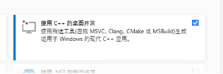

### 2、安装相关依赖

​		相关依赖在requirements.txt中给出，但是因为有版本冲突问题，我这里是自己单独下的。

这是我使用的基本环境

+ python3.8
+ torch2.3.0
+ cuda11.8
+ cudnn8.9.7

接下来安装requirements.txt中给出的依赖

```bash
# 激活你的conda环境
conda activate aniclipart

# 安装依赖项
pip install torch==2.3.0 -i http://mirrors.aliyun.com/pypi/simple --trusted-host mirrors.aliyun.com
pip install torchaudio==2.3.0 -i http://mirrors.aliyun.com/pypi/simple --trusted-host mirrors.aliyun.com
pip install torchvision==0.18.0 -i http://mirrors.aliyun.com/pypi/simple --trusted-host mirrors.aliyun.com
pip install ipywidgets -i http://mirrors.aliyun.com/pypi/simple --trusted-host mirrors.aliyun.com
pip install diffusers -i http://mirrors.aliyun.com/pypi/simple --trusted-host mirrors.aliyun.com
pip install easydict -i http://mirrors.aliyun.com/pypi/simple --trusted-host mirrors.aliyun.com
pip install cssutils -i http://mirrors.aliyun.com/pypi/simple --trusted-host mirrors.aliyun.com
pip install shapely -i http://mirrors.aliyun.com/pypi/simple --trusted-host mirrors.aliyun.com
pip install lightning -i http://mirrors.aliyun.com/pypi/simple --trusted-host mirrors.aliyun.com
pip install imageio==2.34.2 -i http://mirrors.aliyun.com/pypi/simple --trusted-host mirrors.aliyun.com
pip install imageio-ffmpeg==0.4.7 -i http://mirrors.aliyun.com/pypi/simple --trusted-host mirrors.aliyun.com
pip install scikit-image -i http://mirrors.aliyun.com/pypi/simple --trusted-host mirrors.aliyun.com
pip install wandb -i http://mirrors.aliyun.com/pypi/simple --trusted-host mirrors.aliyun.com
pip install moviepy -i http://mirrors.aliyun.com/pypi/simple --trusted-host mirrors.aliyun.com
pip install matplotlib -i http://mirrors.aliyun.com/pypi/simple --trusted-host mirrors.aliyun.com
pip install cairosvg -i http://mirrors.aliyun.com/pypi/simple --trusted-host mirrors.aliyun.com
pip install einops -i http://mirrors.aliyun.com/pypi/simple --trusted-host mirrors.aliyun.com
pip install transformers -i http://mirrors.aliyun.com/pypi/simple --trusted-host mirrors.aliyun.com
pip install accelerate -i http://mirrors.aliyun.com/pypi/simple --trusted-host mirrors.aliyun.com
pip install opencv-python -i http://mirrors.aliyun.com/pypi/simple --trusted-host mirrors.aliyun.com
pip install triangle -i http://mirrors.aliyun.com/pypi/simple --trusted-host mirrors.aliyun.com
pip install bezier -i http://mirrors.aliyun.com/pypi/simple --trusted-host mirrors.aliyun.com
```

### 3、*安装Diffvg

​	这步是最容易出错误的，弄了两天一夜才搞定。

```bash
git clone https://github.com/BachiLi/diffvg.git
cd diffvg
```

注意这里的pybind11 和thrust里面是空的，最好自己在git下载好压缩包拷贝进去，我这里一开始使用了git submodule update --init --recursive这个命令，但是后面安装的时候就一直报错。

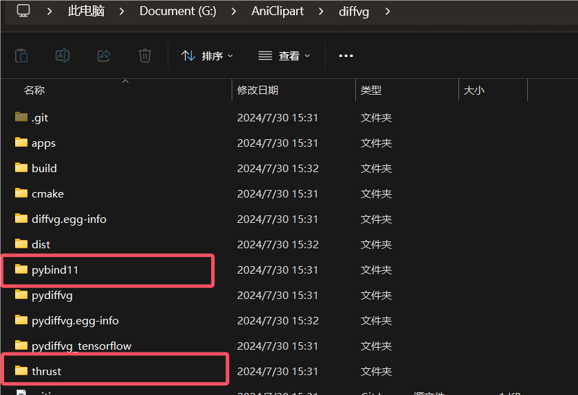

之后进行安装。

```
python setup.py install
```

如果出现问题File "G:\AniClipart\diffvg\setup.py", line 38, in build_extension    '-DPYTHON_LIBRARY=' + get_config_var('LIBDIR')

使用下面的setup.py，把其中的路径改成自己对应的即可。

```python
import os
import sys
import platform
import subprocess
import importlib
from sysconfig import get_paths

from setuptools import setup, Extension
from setuptools.command.build_ext import build_ext
from distutils.sysconfig import get_config_var

class CMakeExtension(Extension):
    def __init__(self, name, sourcedir, build_with_cuda):
        Extension.__init__(self, name, sources=[])
        self.sourcedir = os.path.abspath(sourcedir)
        self.build_with_cuda = build_with_cuda

class Build(build_ext):
    def run(self):
        try:
            subprocess.check_output(['cmake', '--version'])
        except OSError:
            raise RuntimeError("CMake must be installed to build the following extensions: " +
                               ", ".join(e.name for e in self.extensions))

        super().run()

    def build_extension(self, ext):
        if isinstance(ext, CMakeExtension):
            extdir = os.path.abspath(os.path.dirname(self.get_ext_fullpath(ext.name)))
            include_path = 'D:\\anaconda3\\envs\\aniclipart\\include'
            libdir = 'D:\\anaconda3\\envs\\aniclipart\\libs'

            cmake_args = ['-DCMAKE_LIBRARY_OUTPUT_DIRECTORY=' + extdir,
                          '-DPYTHON_LIBRARY=' + libdir,
                          '-DPYTHON_INCLUDE_PATH=' + include_path]

            cfg = 'Debug' if self.debug else 'Release'
            build_args = ['--config', cfg]

            if platform.system() == "Windows":
                cmake_args += ['-DCMAKE_LIBRARY_OUTPUT_DIRECTORY_{}={}'.format(cfg.upper(), extdir),
                               '-DCMAKE_RUNTIME_OUTPUT_DIRECTORY_{}={}'.format(cfg.upper(), extdir)]
                if sys.maxsize > 2**32:
                    cmake_args += ['-A', 'x64']
                build_args += ['--', '/m']
            else:
                cmake_args += ['-DCMAKE_BUILD_TYPE=' + cfg]
                build_args += ['--', '-j8']

            if ext.build_with_cuda:
                cmake_args += ['-DDIFFVG_CUDA=1']
            else:
                cmake_args += ['-DDIFFVG_CUDA=0']

            env = os.environ.copy()
            env['CXXFLAGS'] = '{} -DVERSION_INFO=\\"{}\\"'.format(env.get('CXXFLAGS', ''),
                                                                  self.distribution.get_version())
            if not os.path.exists(self.build_temp):
                os.makedirs(self.build_temp)
            subprocess.check_call(['cmake', ext.sourcedir] + cmake_args, cwd=self.build_temp, env=env)
            subprocess.check_call(['cmake', '--build', '.'] + build_args, cwd=self.build_temp)
        else:
            super().build_extension(ext)

torch_spec = importlib.util.find_spec("torch")
tf_spec = importlib.util.find_spec("tensorflow")
packages = []
build_with_cuda = False
if torch_spec is not None:
    packages.append('pydiffvg')
    import torch
    if torch.cuda.is_available():
        build_with_cuda = True
if tf_spec is not None and sys.platform != 'win32':
    packages.append('pydiffvg_tensorflow')
    if not build_with_cuda:
        import tensorflow as tf
        if tf.test.is_gpu_available():
            build_with_cuda = True

setup(
    name='pydiffvg',
    version='0.0.1',
    author='Wenzheng Chen',
    author_email='wenzchen@cs.toronto.edu',
    description='Differentiable Vector Graphics',
    long_description='',
    ext_modules=[CMakeExtension('pydiffvg', '.', build_with_cuda)],
    cmdclass=dict(build_ext=Build),
    zip_safe=False,
    packages=packages,
)
```

### 二、测试运行

### 2.1 给定demo

**单层动画 (Single-layer animation)**:

```
bash scripts/run_aniclipart.sh
```

**多层动画 (Multi-layer animation)**:

```
bash scripts/run_layer_aniclipart.sh
```

因算力有限，我测试了单层动画给出的几个demo。

如下：

初始状态


栅格化和曲线化

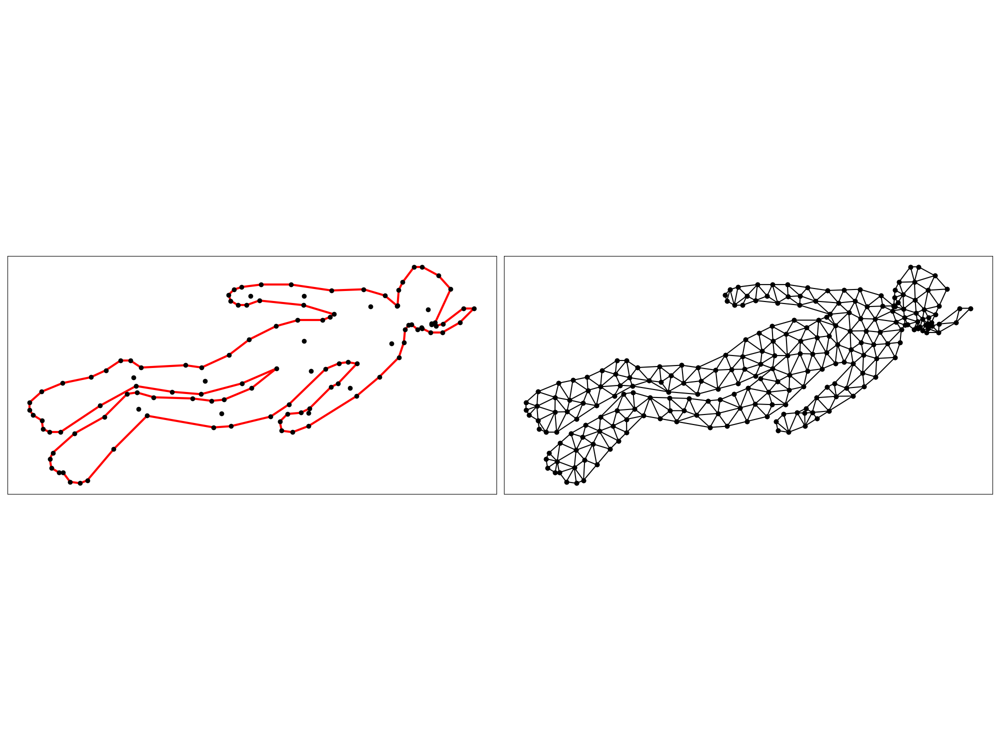|

|

最后效果:


其他的


### 2.2 自制作贴图

（1）**使用picosvg简化**，PicoSVG是一个专门用于简化SVG图形的强大工具，通过一系列精心设计的转换规则，将任意SVG优化为“pico”版本，即更轻量级且结构更加整洁的格式。它确保每个SVG遵循严格的结构准则，从而提升图形在各种应用中的表现力和兼容性。

```shell
#格式化
picosvg shark_input.svg > shark.svg
```


（2）**Keypoint Detection**：生成其轮廓，并对轮廓进行简化，生成骨架和关键点。

```shell
#安装依赖
conda install -c conda-forge scikit-geometry
#运行 把target改成对应的名字
python -m preprocess.keypoint_detection
```

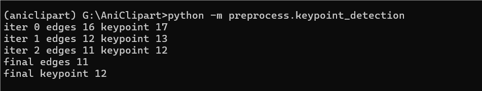

|

（3）格式化大小

```
#修改target
python -m preprocess.svg_resize
```


（4）添加描述

```
#打开 utils/util.py 文件，找到 get_clipart_caption 函数，查看 files_to_captions 字典的定义。
添加如下定义
'shark': 'A shark swimming in the ocean'
```

（5）开始生成

```bash
bash scripts/run_aniclipart.sh
```


由于显存只有6G，出现Out of memory.

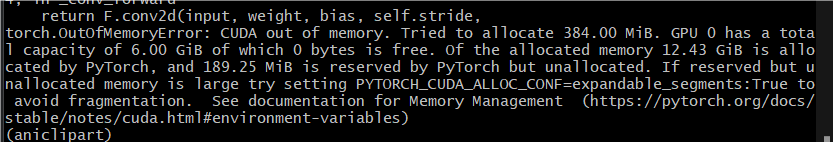

其他效果

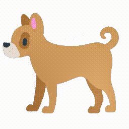

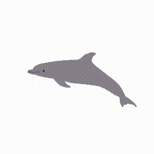


### 2.3 参数影响

#### (1) num_frames=24     num_iter=5

由于显存有限，所以只使用CPU进行测试。

```bash
   --bezier_radius 0.01 \
        --augment_frames \
        --lr_bezier 0.005 \
        --num_iter 5 \
        --num_frames 24 \
        --inter_dim 128 \
        --loop_num 2 \
        --guidance_scale 50 \
        --opt_bezier_points_with_mlp \
        --normalize_input \
        --opt_with_skeleton \
        --skeleton_weight 25 \
        --fix_start_points \
        --arap_weight 3000 \
        --opt_with_layered_arap \
        --max_tri_area 30 \
        --min_tri_degree 20 \
        --need_subdivide
```

+ num_iter 调节运动范围，如果默认500，需要训练时间较久。
+ num_frames 生成图像的帧数


#### (2) num_frames=12     num_iter=5


#### (3) num_frames=24   num_iter=20

在贝塞尔曲线控制点不变的情况下，可以看出当num_iter次数增大，整体的动作幅度会随之增大，


### 三、使用AWS服务器部署

### 3.1 服务器基本配置

+ 4vcpu、100G
+ g4dn-xlarge 16GB内存、1个NVIDIA T4 GPU
+ ubuntu 20.04
+ cuda 11.8

```bash
#安装依赖项
sudo apt install build-essential git wget
#安装conda
wget https://repo.anaconda.com/miniconda/Miniconda3-py38_22.11.1-1-Linux-x86_64.sh
Miniconda3-py38_22.11.1-1-Linux-x86_64.sh
source ~/.bashrc
```

+  安装CUDA

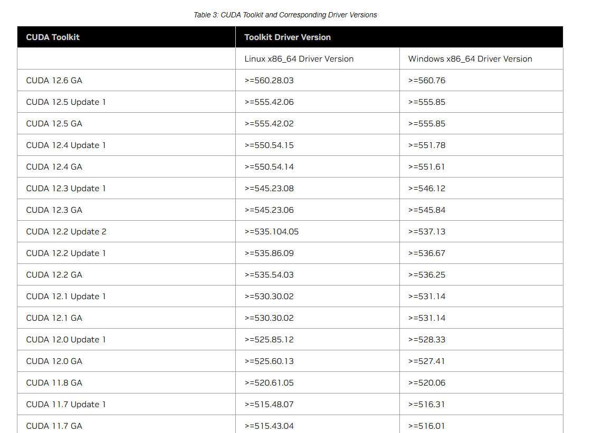

```bash
因为安装Cuda11.8需要gcc-9、g++-9,版本，ubuntu20.04直接安装的是gcc-13，如果安装gcc-8也不行，所以最终试下来是gcc-9
#1 安装gcc g++
conda install -c conda-forge gcc=9 gxx=9
或者
sudo apt-get install gcc-9 g++-9
#2 安装cmake
pip install cmake
# 安装N卡驱动
 lspci | grep -i nvidia #查看是否有gpu显卡
 ubuntu-drivers devices #自动检测你的显卡型号和推荐安装的驱动型号
 sudo ubuntu-drivers autoinstall #可以自动选择合适驱动版本安装
 sudo gedit ~/.bashrc #设置环境变量，写入下面两行
 export LD_LIBRARY_PATH=/usr/lib/x86_64-linux-gnu:$LD_LIBRARY_PATH
export LD_LIBRARY_PATH=/lib/x86_64-linux-gnu:$LD_LIBRARY_PATH
nvidia-smi #输入验证
#安装cuda
wget https://developer.download.nvidia.com/compute/cuda/11.8.0/local_installers/cuda_11.8.0_520.61.05_linux.run
sudo sh cuda_11.8.0_520.61.05_linux.run
#安装cudnn，一定要下载tar格式！
从NVIDIA官网的cudnn下载页面上下载与安装CUDA对应的cudnn，网址为https://developer.nvidia.com/rdp/cudnn-download。选择Ubuntu20.04系统下，CUDA11.8对应的版本，下载完后使用tar -zxvf解压
然后执行
cp cuda/lib64/* /usr/local/cuda-11.7/lib64/
cp cuda/include/* /usr/local/cuda-11.7/include/
#输入验证cudnn
cat /usr/local/cuda-11.7/include/cudnn_version.h | grep CUDNN_MAJOR -A 2 
```


+  安装Aniclipart

```bash
#1 AniClipart
git clone https://github.com/kingnobro/AniClipart.git
cd AniClipart
#2 创建虚拟环境
conda create -n aniclipart python=3.8
conda activate aniclipart
#3 安装依赖项
pip install torch==2.3.0 
pip install torchaudio==2.3.0 
pip install torchvision==0.18.0 
pip install ipywidgets 
pip install diffusers 
pip install easydict 
pip install cssutils 
pip install shapely 
pip install lightning 
pip install imageio==2.34.2 
pip install imageio-ffmpeg==0.4.7 
pip install scikit-image 
pip install wandb 
pip install moviepy 
pip install matplotlib 
pip install cairosvg 
pip install einops 
pip install transformers 
pip install accelerate 
pip install opencv-python 
pip install triangle 
pip install bezier 
```

+  安装diffvg

```
git clone https://github.com/BachiLi/diffvg.git
cd diffvg
git submodule update --init --recursive
python setup.py install
```

中途可能遇到的问题

（1）  from /home/ubuntu/AniClipart/diffvg/diffvg.cpp:20: /home/ubuntu/miniconda3/envs/aniclipart/include/python3.8/Python.h:44:10: fatal error: crypt.h: No such file or directory   44 | #include <crypt.h>      |          ^~~~~~~~~ compilation terminated.

是因为在构建过程中缺少 `crypt.h` 头文件。`crypt.h` 是一个系统头文件，通常包含在 `libxcrypt-dev` 包中

```bash
#解决方案
sudo apt-get update
sudo apt-get install libc6-dev
conda install --channel=conda-forge libxcrypt
#拷贝到虚拟环境
cp /usr/include/crypt.h /home/ubuntu/miniconda/envs/anlicpart/include/python3.8/crypt.h
```


(2)CMake Error at CMakeLists.txt:3 (project):  The CMAKE_CXX_COMPILER:     /home/ubuntu/miniconda3/envs/aniclipart/bin/x86_64-conda-linux-gnu-c++   is not a full path to an existing compiler tool.   Tell CMake where to find the compiler by setting either the environment  variable "CXX" or the CMake cache entry CMAKE_CXX_COMPILER to the full path  to the compiler, or to the compiler name if it is in the PATH.

遇到这个问题一方面可能是CMake 无法找到指定的编译器路径。要确保 Conda 环境中的 GCC 9 路径正确，并且 CMake 能够识别这些路径。

有可能是gcc版本太多有冲突，要学会如何切换gcc、g++版本

```bash
#按数字选择版本
sudo update-alternatives --config gcc
sudo update-alternatives --config g++
```

也有可能是环境变量没有配置好

```bash
#编辑
vim ~/.bashrc
写入
export PATH=/usr/local/gcc-9.3.0/bin:$PATH
export LD_LIBRARY_PATH=/usr/local/gcc-9.3.0/lib64:$LD_LIBRARY_PATH
#重新加载
source ~/.bashrc
#验证
gcc --version
g++ --version
```

### 3.2 运行测试

在此服务器配置下，iter500次耗时1.5h-2h。

```bash
#运行单层anilicpart
bash scripts/run_aniclipart.sh
```

测试中遇到的主要问题-CUDA out of memory

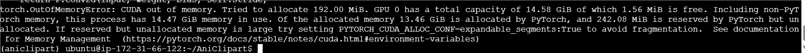

出现这个问题是显存不足的问题，通过查找资料

有如下解决方案：

（1）逐步调小PYTORCH_CUDA_ALLOC_CONF，但是会损失性能。

```bash
set PYTORCH_CUDA_ALLOC_CONF=max_split_size_mb:16
```

调了好几次，没有效果

（2）不累加loss及 `torch.cuda.empty_cache()` 手动清理 失活内存

我在for循环每次迭代后面使用了torch.cuda.empty_cache()，但是依然不行

（2）需要调整模型大小及精度

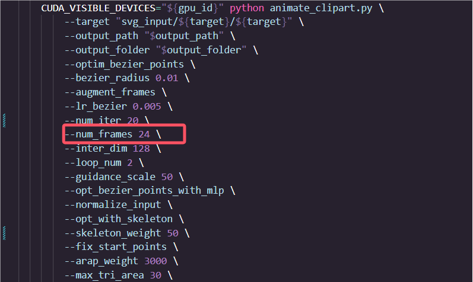

这里必须要牺牲帧数去换取空间，我尝试了几个帧数24、20、18、16、12。

num_frames=12最终可以成功跑起来，虽然出来的动作会不太流畅，但是能在显存16G的情况下跑起来。

论文中使用的n NVIDIA RTX A6000  26GB，能轻松跑起来24帧数的，且迭代500次只需要30分钟。

通过这次，谈谈对out of memory的认识：

对于CUDA运行时，其固件会占用一定的显存，不同的CUDA版本或显卡型号固件显存不同。换言之，只要使用了GPU，就至少会占x xx M的显存，且这部分显存无法被释放。CUDA内存管理机制在使用显存时，将内存分为激活内存和失活内存两种状态，并通过一种类似队列的方式进行管理。

1. **激活内存（Activate Memory）**：
   - 这部分内存当前正被变量或数据所引用，处于活跃使用状态。
   - 当需要进行计算或处理时，CUDA会将数据加载到激活内存中。
2. **失活内存（Unactivate Memory）**：
   - 当一块内存不再被任何变量所引用时，它会从激活内存转为失活内存。
   - 失活内存仍然存在于CUDA的内存队列中，但暂时不被使用。

当新的数据需要被加载到显存时，CUDA会按照以下步骤处理内存：

1. **检查失活内存**：
   - CUDA会首先检查失活内存，看看是否有足够的空间来存放新的数据。
2. **释放失活内存**：
   - 如果失活内存中的空间足够，CUDA会将这部分内存释放出来用于存放新的数据。
3. **显存扩展**：
   - 如果失活内存中的空间不足，CUDA会从显存中申请更多的空间来存放新的数据。这相当于扩展了队列的容量。

所以（1）GPU显存占用率和存入的数据尺寸成正相关，越大的数据占用显存越多；（2）只要使用了GPU，就至少会占x xx M的显存，且这部分显存无法被释放；（3）当一块内存不再被变量所引用时，这块内存就由激活内存转为失活内存，但它仍然存在于这个数据队列中；（4）当数据队列达到某个阈值时，CUDA会触发垃圾回收机制，清理失活内存（5）运行torch.cuda.empty_cache()可以手动清理失活内存


原文链接：https://blog.csdn.net/frigidwinter/article/details/130033162

### 3.3测试结果

(1)使用原有的woman_dance进行50次iter和500次对比

caption：caption: A woman in a green dress with black polka dots and black boots is dancing
  joyfully.

|||

（2）自制作贴图

+ dog

caption："dog": "A dog is running."

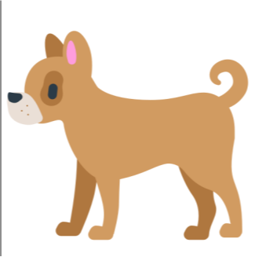|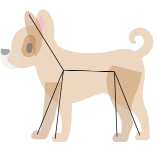||

tier500次后的结果：

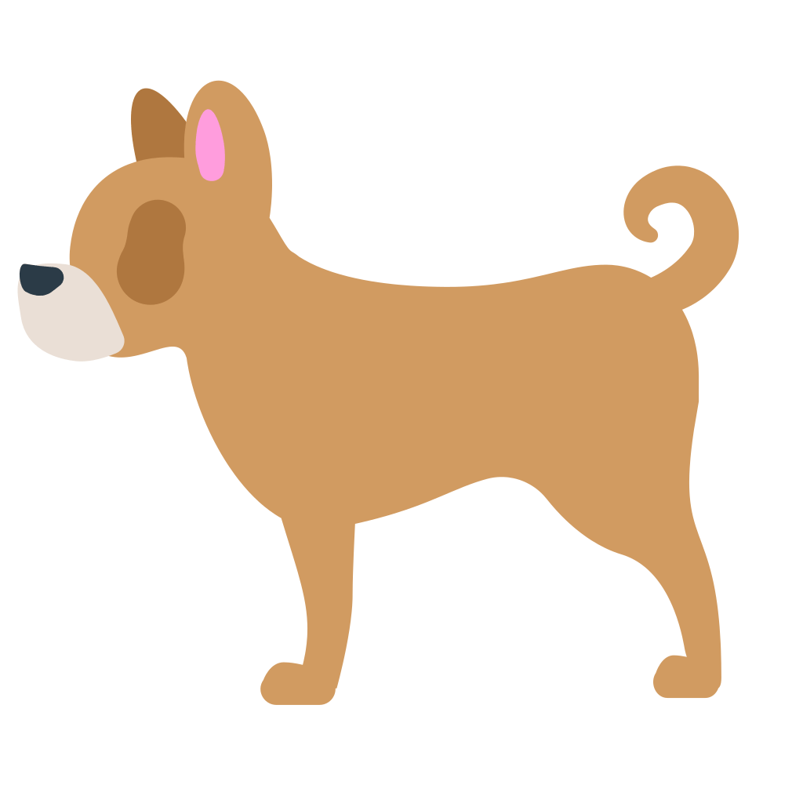

​	从这个结果分析来看，有可能是贴图找的不太合适，导致在处理帧的时候将dog的eye和其中另一边的legs都去掉了，但是最终来看，dog的运动轨迹还是比较贴切的。

+ shark

caption:'shark': 'A shark swimming in the ocean'

||


+ seal

caption: "seal": "A seal is floating up and down in the water, waving its flippers and tail"

|||

+ chicken

caption:"chicken": "A chicken is jumping up and down."

||

+ elephant

caption:"elephant": "An elephant jumps and wags its trunk up and down continuously.",

|||

### 四、常见问题

（1）LINK : fatal error LNK1104:  “python38.lib”

在build文件夹内新建一个名为Directory.Build.props的文件。指向自己conda环境的python38.lib所在文件夹。可用软件everything搜索。

```xml
<Project>
 <ItemDefinitionGroup>
 <Link>
 <AdditionalLibraryDirectories>C:\XXXXXX\Python38\libs;%(AdditionalLibraryDirectories)</AdditionalLibraryDirectories>
 </Link>
 </ItemDefinitionGroup>
</Project>
```

（2）ModuleNotFoundError: No module named 'diffvg'

在conda环境文件夹中找到diffvg-0.0.1-py3.8-win-amd64.egg。可用软件everything搜索。

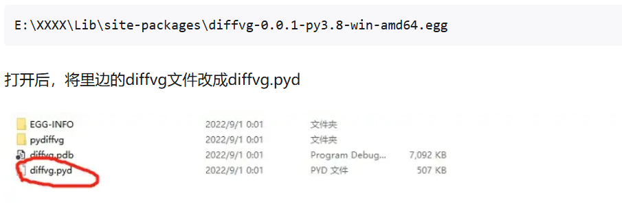

（3）   import diffvg ImportError: DLL load failed while importing diffvg: ▒Ҳ▒▒▒ָ▒▒▒▒ģ▒顣

这种问题说是DLL loadfailed，我下载了Dependencies去查看这个的依赖。

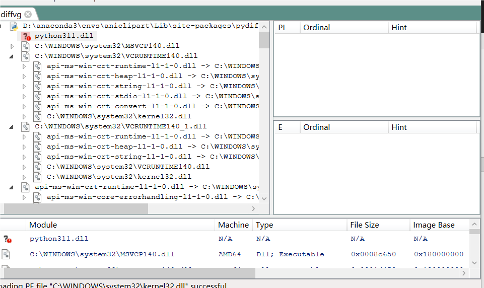

​		发现我明明是在conda3.8环境下安装的，为什么会出现这种情况。有可能是我conda的版本太新了也有可能是我的环境太混乱了，所以我把conda删掉了，重新下了一个旧一点的，这次再查看就没问题了，之前试过了很多方法都没有用。

（4）对于出现的其他情况

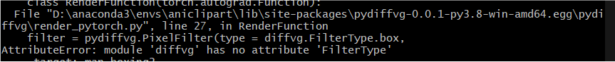

像这种之类的，在aniclipart仓库里面的issue有些可能会有。其他的按照这个步骤来应该都没什么问题。 

(5)安装了CUDA 、pytorch之后无法调用GPU

直接在终端里pip install torch torchvision torchaudio的版本是适用于只有CPU的，所以是无法调用的，从官网里面的[PyTorch](https://pytorch.org/)安装。如果遇到网络超时直接点对应的链接，下载对应的版本到本地再安装

```
pip3 install torch torchvision torchaudio --index-url https://download.pytorch.org/whl/cu118
```

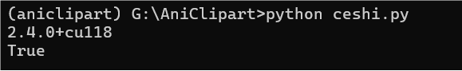

### 五、相关链接

在部署aniclipart的过程中遇到了很多问题，非常感谢github社区及CSDN上创作者门的帮助。以下是一些链接。

[CUDA安装及环境配置——最新详细版-CSDN博客](https://blog.csdn.net/chen565884393/article/details/127905428)

[win10，python，安装diffvg - 知乎 (zhihu.com)](https://zhuanlan.zhihu.com/p/560277508)

[Compile diffvg sucess on Windows, give you wheel · Issue #82 · BachiLi/diffvg (github.com)](https://github.com/BachiLi/diffvg/issues/82)