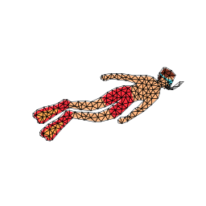

# AniClipart: Clipart Animation with Text-to-Video Priors 部署报告

孙志强

---

地址：[AniClipart: Clipart Animation with Text-to-Video Priors](https://aniclipart.github.io/)

仓库地址：[kingnobro/AniClipart: Code of "AniClipart: Clipart Animation with Text-to-Video Priors" (github.com)](https://github.com/kingnobro/AniClipart)

AniClipart项目旨在使用文本提示和机器学习技术为静态SVG（可缩放矢量图形）文件生成动画。以下是AniClipart的关键方面和目标：

**主要目标：**

1. **动画化静态SVG文件**：
   - 主要目标是将静态的SVG图像转换为动态动画，使静态图形变得生动起来，赋予它们运动和互动。
2. **文本提示集成**：
   - 用户可以提供文本提示来指导动画生成过程。这些提示帮助定义动画的类型或动画应传达的故事。
3. **机器学习和扩散模型**：
   - 项目使用机器学习模型，特别是扩散模型，来生成动画。这些模型解释文本提示并将适当的转换应用于SVG图像。

**关键技术：**

1. **Painter类和PainterOptimizer**：
   - Painter类定义了所有关于栅格化和曲线的内容，PainterOptimizer用于优化这些曲线。
2. **损失函数**：
   - 使用SDSVideoLoss和SkeletonLoss等损失函数来优化动画生成。
3. **数据增强**：
   - 通过各种图像增强技术来防止对抗性结果，使动画更自然。
4. **高效渲染和存储**：
   - 使用PyDiffVG库进行高效的SVG渲染，并将生成的动画保存为高质量的视频和GIF。

**工作流程：**

1. **解析参数**：
   - 通过argparse解析用户输入的参数，如目标SVG文件、文本提示、输出路径、模型名称等。
2. **初始化Painter和优化器**：
   - 创建Painter实例并初始化优化器，用于处理SVG文件并进行动画生成。
3. **渲染和优化**：
   - 渲染初始帧，并使用损失函数和优化器进行多次迭代，以生成最终的动画。
4. **保存结果**：
   - 将生成的动画保存为视频文件，并可选择上传到WandB进行结果追踪和可视化。

### 一、环境搭建

### 1、使用Conda创建虚拟环境及安装VS2019

​		这里推荐使用conda3-py38的版本，一开始用的最新的conda3后面跑起来有点问题，也可能是我自己弄的环境太混乱了。

```bash
# （1）拷贝项目代码
git clone https://github.com/kingnobro/AniClipart.git
cd AniClipart
# （2）创建虚拟环境
conda create --name aniclipart python=3.8
conda activate aniclipart
#如果这里出问题，先conda init bash 初始化，再尝试一下
```

下一步是安装VS2019，我之前使用的VS2022,可能是太新了导致编译的过程中会出现问题，所以选择了比较旧的一个版本。

链接：https://pan.baidu.com/s/1D8eGWZwkRBoGyDiriWa-Hw?pwd=g790
提取码：g790
在安装的过程中只需选择使用C++的桌面开发即可，大概5-6GB.


### 2、安装相关依赖

​		相关依赖在requirements.txt中给出，但是因为有版本冲突问题，我这里是自己单独下的。

这是我使用的基本环境

+ python3.8
+ torch2.3.0
+ cuda11.8
+ cudnn8.9.7

接下来安装requirements.txt中给出的依赖

```bash
# 激活你的conda环境
conda activate aniclipart

# 安装依赖项
pip install torch==2.3.0 -i http://mirrors.aliyun.com/pypi/simple --trusted-host mirrors.aliyun.com
pip install torchaudio==2.3.0 -i http://mirrors.aliyun.com/pypi/simple --trusted-host mirrors.aliyun.com
pip install torchvision==0.18.0 -i http://mirrors.aliyun.com/pypi/simple --trusted-host mirrors.aliyun.com
pip install ipywidgets -i http://mirrors.aliyun.com/pypi/simple --trusted-host mirrors.aliyun.com
pip install diffusers -i http://mirrors.aliyun.com/pypi/simple --trusted-host mirrors.aliyun.com
pip install easydict -i http://mirrors.aliyun.com/pypi/simple --trusted-host mirrors.aliyun.com
pip install cssutils -i http://mirrors.aliyun.com/pypi/simple --trusted-host mirrors.aliyun.com
pip install shapely -i http://mirrors.aliyun.com/pypi/simple --trusted-host mirrors.aliyun.com
pip install lightning -i http://mirrors.aliyun.com/pypi/simple --trusted-host mirrors.aliyun.com
pip install imageio==2.34.2 -i http://mirrors.aliyun.com/pypi/simple --trusted-host mirrors.aliyun.com
pip install imageio-ffmpeg==0.4.7 -i http://mirrors.aliyun.com/pypi/simple --trusted-host mirrors.aliyun.com
pip install scikit-image -i http://mirrors.aliyun.com/pypi/simple --trusted-host mirrors.aliyun.com
pip install wandb -i http://mirrors.aliyun.com/pypi/simple --trusted-host mirrors.aliyun.com
pip install moviepy -i http://mirrors.aliyun.com/pypi/simple --trusted-host mirrors.aliyun.com
pip install matplotlib -i http://mirrors.aliyun.com/pypi/simple --trusted-host mirrors.aliyun.com
pip install cairosvg -i http://mirrors.aliyun.com/pypi/simple --trusted-host mirrors.aliyun.com
pip install einops -i http://mirrors.aliyun.com/pypi/simple --trusted-host mirrors.aliyun.com
pip install transformers -i http://mirrors.aliyun.com/pypi/simple --trusted-host mirrors.aliyun.com
pip install accelerate -i http://mirrors.aliyun.com/pypi/simple --trusted-host mirrors.aliyun.com
pip install opencv-python -i http://mirrors.aliyun.com/pypi/simple --trusted-host mirrors.aliyun.com
pip install triangle -i http://mirrors.aliyun.com/pypi/simple --trusted-host mirrors.aliyun.com
pip install bezier -i http://mirrors.aliyun.com/pypi/simple --trusted-host mirrors.aliyun.com
```

### 3、*安装Diffvg

​	这步是最容易出错误的，弄了两天一夜才搞定。

```bash
git clone https://github.com/BachiLi/diffvg.git
cd diffvg
```

注意这里的pybind11 和thrust里面是空的，最好自己在git下载好压缩包拷贝进去，我这里一开始使用了git submodule update --init --recursive这个命令，但是后面安装的时候就一直报错。


之后进行安装。

```
python setup.py install
```

如果出现问题File "G:\AniClipart\diffvg\setup.py", line 38, in build_extension    '-DPYTHON_LIBRARY=' + get_config_var('LIBDIR')

使用下面的setup.py，把其中的路径改成自己对应的即可。

```python
import os
import sys
import platform
import subprocess
import importlib
from sysconfig import get_paths

from setuptools import setup, Extension
from setuptools.command.build_ext import build_ext
from distutils.sysconfig import get_config_var

class CMakeExtension(Extension):
    def __init__(self, name, sourcedir, build_with_cuda):
        Extension.__init__(self, name, sources=[])
        self.sourcedir = os.path.abspath(sourcedir)
        self.build_with_cuda = build_with_cuda

class Build(build_ext):
    def run(self):
        try:
            subprocess.check_output(['cmake', '--version'])
        except OSError:
            raise RuntimeError("CMake must be installed to build the following extensions: " +
                               ", ".join(e.name for e in self.extensions))

        super().run()

    def build_extension(self, ext):
        if isinstance(ext, CMakeExtension):
            extdir = os.path.abspath(os.path.dirname(self.get_ext_fullpath(ext.name)))
            include_path = 'D:\\anaconda3\\envs\\aniclipart\\include'
            libdir = 'D:\\anaconda3\\envs\\aniclipart\\libs'

            cmake_args = ['-DCMAKE_LIBRARY_OUTPUT_DIRECTORY=' + extdir,
                          '-DPYTHON_LIBRARY=' + libdir,
                          '-DPYTHON_INCLUDE_PATH=' + include_path]

            cfg = 'Debug' if self.debug else 'Release'
            build_args = ['--config', cfg]

            if platform.system() == "Windows":
                cmake_args += ['-DCMAKE_LIBRARY_OUTPUT_DIRECTORY_{}={}'.format(cfg.upper(), extdir),
                               '-DCMAKE_RUNTIME_OUTPUT_DIRECTORY_{}={}'.format(cfg.upper(), extdir)]
                if sys.maxsize > 2**32:
                    cmake_args += ['-A', 'x64']
                build_args += ['--', '/m']
            else:
                cmake_args += ['-DCMAKE_BUILD_TYPE=' + cfg]
                build_args += ['--', '-j8']

            if ext.build_with_cuda:
                cmake_args += ['-DDIFFVG_CUDA=1']
            else:
                cmake_args += ['-DDIFFVG_CUDA=0']

            env = os.environ.copy()
            env['CXXFLAGS'] = '{} -DVERSION_INFO=\\"{}\\"'.format(env.get('CXXFLAGS', ''),
                                                                  self.distribution.get_version())
            if not os.path.exists(self.build_temp):
                os.makedirs(self.build_temp)
            subprocess.check_call(['cmake', ext.sourcedir] + cmake_args, cwd=self.build_temp, env=env)
            subprocess.check_call(['cmake', '--build', '.'] + build_args, cwd=self.build_temp)
        else:
            super().build_extension(ext)

torch_spec = importlib.util.find_spec("torch")
tf_spec = importlib.util.find_spec("tensorflow")
packages = []
build_with_cuda = False
if torch_spec is not None:
    packages.append('pydiffvg')
    import torch
    if torch.cuda.is_available():
        build_with_cuda = True
if tf_spec is not None and sys.platform != 'win32':
    packages.append('pydiffvg_tensorflow')
    if not build_with_cuda:
        import tensorflow as tf
        if tf.test.is_gpu_available():
            build_with_cuda = True

setup(
    name='pydiffvg',
    version='0.0.1',
    author='Wenzheng Chen',
    author_email='wenzchen@cs.toronto.edu',
    description='Differentiable Vector Graphics',
    long_description='',
    ext_modules=[CMakeExtension('pydiffvg', '.', build_with_cuda)],
    cmdclass=dict(build_ext=Build),
    zip_safe=False,
    packages=packages,
)
```

### 二、测试运行

**单层动画 (Single-layer animation)**:

```
bash scripts/run_aniclipart.sh
```

**多层动画 (Multi-layer animation)**:

```
bash scripts/run_layer_aniclipart.sh
```

因算力有限，我测试了单层动画给出的几个demo。

如下：

初始状态


栅格化和曲线化

|

|

最后效果:


其他的


### 三、常见问题

（1）LINK : fatal error LNK1104:  “python38.lib”

在build文件夹内新建一个名为Directory.Build.props的文件。指向自己conda环境的python38.lib所在文件夹。可用软件everything搜索。

```xml
<Project>
 <ItemDefinitionGroup>
 <Link>
 <AdditionalLibraryDirectories>C:\XXXXXX\Python38\libs;%(AdditionalLibraryDirectories)</AdditionalLibraryDirectories>
 </Link>
 </ItemDefinitionGroup>
</Project>
```

（2）ModuleNotFoundError: No module named 'diffvg'

在conda环境文件夹中找到diffvg-0.0.1-py3.8-win-amd64.egg。可用软件everything搜索。


（3）   import diffvg ImportError: DLL load failed while importing diffvg: ▒Ҳ▒▒▒ָ▒▒▒▒ģ▒顣

这种问题说是DLL loadfailed，我下载了Dependencies去查看这个的依赖。


​		发现我明明是在conda3.8环境下安装的，为什么会出现这种情况。有可能是我conda的版本太新了也有可能是我的环境太混乱了，所以我把conda删掉了，重新下了一个旧一点的，这次再查看就没问题了，之前试过了很多方法都没有用。

（4）对于出现的其他情况


像这种之类的，在aniclipart仓库里面的issue有些可能会有。其他的按照这个步骤来应该都没什么问题。 

### 四、相关链接

在部署aniclipart的过程中遇到了很多问题，非常感谢github社区及CSDN上创作者门的帮助。以下是一些链接。

[CUDA安装及环境配置——最新详细版-CSDN博客](https://blog.csdn.net/chen565884393/article/details/127905428)

[win10，python，安装diffvg - 知乎 (zhihu.com)](https://zhuanlan.zhihu.com/p/560277508)

[Compile diffvg sucess on Windows, give you wheel · Issue #82 · BachiLi/diffvg (github.com)](https://github.com/BachiLi/diffvg/issues/82)