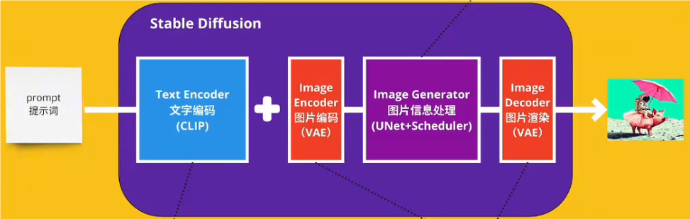
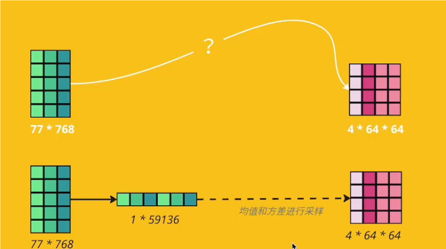
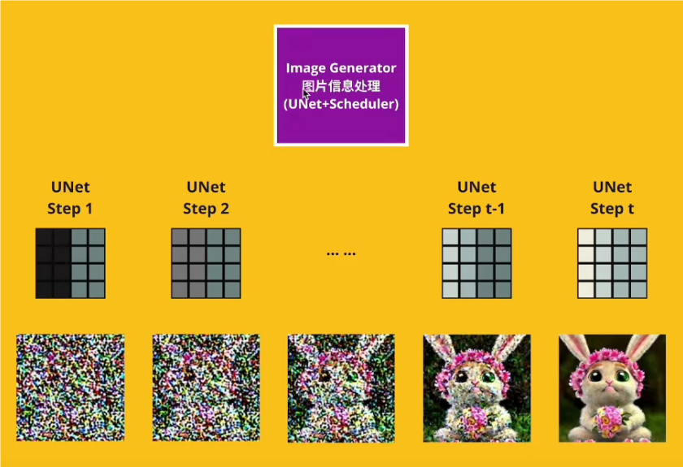
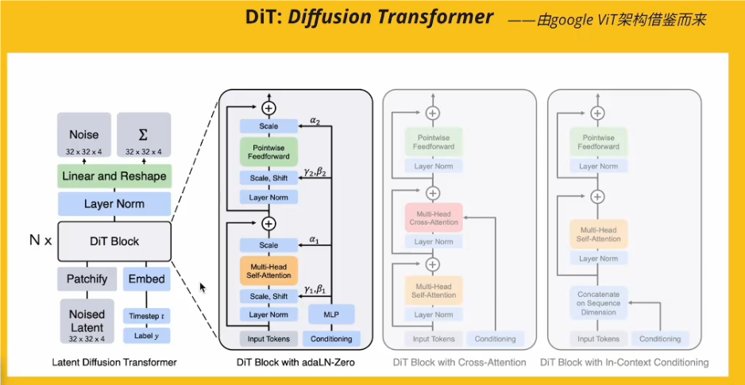

# 针对游戏形象图+文生视频模型调研报告

​                                                                                                                                                                                                         孙志强

---

## 1、引言

### 1.1 背景及目标

​       近年来，随着人工智能技术的发展，基于AI的内容生成在游戏开发、影视制作和虚拟现实等领域得到了广泛应用。为了增强用户体验并提高内容制作效率，游戏开发者需要一种能够将静态游戏形象和文字描述转换为一致动作视频的技术解决方案。本文档通过调研现有的开源和商用解决方案，找到最佳实践，帮助游戏开发团队实现这一需求。

### 1.2 意义

针对静态游戏角色图片生成形象一致的动作视频有以下几方面的重要意义：

+ **提高内容创作效率**：通过自动化生成视频内容，可以显著减少人工制作的时间和成本。
+ **增强用户体验**：动态视频比静态图像更具表现力，能够更好地展示游戏角色的特性和行为。
+ **个性化内容生成**：根据用户的描述生成特定动作视频，可以实现高度个性化的内容，提升用户满意度。
+ **丰富互动方式**：在游戏中引入动态视频内容，可以增加游戏的互动性和趣味性，吸引更多用户。

## 2、Stable Diffusion、Sora等文生图视频大模型原理简单原理

​     由于之前未有SD模型等相关技术的基础知识，因为在调研目前主流可用模型项目之前先阐述基础的相关原理，以提高后续调研的效率及科学性、有效性。

### 2.1  基础技术及概念

| 名称      | 概念                                      | 年份 |
| --------- | ----------------------------------------- | ---- |
| Sora      | OpenAI的视觉大模型                        | 2023 |
| Diffusion | 扩散器技术                                | 2015 |
| DDPM      | Denoising Diffusion Probabilistic Models  | 2020 |
| U-Net     | 一种DDPM模型                              | 2020 |
| VIT       | Vision Transformer 为了图像识别           | 2020 |
| DIT       | Diffusion Transformer为了图像生成         | 2023 |
| VAE       | Variant Auto Encoder 一个升降维的概率模型 | 2013 |
| CLIP      | Contrastive Language-lmage Pre-training   | 2021 |
| Gaussian  | 高斯分布                                  |      |
| LDM       | Latent Diffusion Models                   |      |

+ Diffusion模型是深度学习领域中一种用于生成数据的模型，它的基本原理是通过一个逐渐去噪的过程从随机噪声生成清晰的图像或其他数据。
+ DDPM：DDPM模型的核心思想是通过逐步去噪来生成数据
+ VIT由Google Research团队在2020年提出，ViT在图像分类任务中取得了显著的效果，尤其是在有大量数据进行预训练的情况下。
+ DiT (Diffusion Transformer) 是一种结合扩散模型和Transformer架构的生成模型，主要用于高质量图像生成任务。DiT利用Transformer的强大建模能力和扩散模型的逐步去噪过程，能够生成具有丰富细节和高分辨率的图像。DIT借助了VIT的架构，融合了diffusion
+ VAE：自动编码解码器
+ CLIP：训练图像和文字关联度
+ Gaussian:用于Diffusion中生成噪音的时候会用到
+ LDM：潜在空间---降维

### 2.2 Stable Diffusion早期架构

+ CLIP model: 典型的transformer语言模型(Contrastive Language-lmage Pre-training），CLIP是在大量“像素图片+文字标签”的数据集上训练的,故可将文字token与像素token合并在一个向量空间中计算近似度。
+ VAE encoder/ VAE decoder (Varigtional Auto Encoder)，编码器:将复杂的高维数据(如图像、音频)表示为低维的向量，其输出的是一个概率分布(高斯分布)的参数(均值和方差)；解码器:从低维向量空间中采样点并将其映射回高维数据空间。
+ Latent Space: 潜在子空间，或叫图像信息空间；Pixel space: 像素空间 (latent space计算量比老版的difusion的pixel space要小很多)

其中的Latent Space降维过程

图片信息处理，即训练过程： 分为（1）前向扩散过程（Forward Diffusion Process）→图片中添加噪声；（2）反向扩散过程（Reverse Diffusion Process）→去除图片中的噪声。

### 2.3 Sora 、Runway、可灵等架构

​        与Stable Diffusion关键的区别在于图片信息处理部分将原来的Unet模型换成了**Transformer**。其训练效率更高，效果也更显著。并且，可以输入训练**不同大小尺寸**的图片，因为其能将图片分解为一个个**Patch**（32*32），多个Patch会通过添加位置信息拼成原来的图片尺寸。

## 3、目前最好的主流商用项目（游戏形象图+字--->视频）

### 3.1 Runway Gen-3 Alpha

**网址**：[Gen-3 Alpha | Runway (runwayml.com)](https://runwayml.com/ai-tools/gen-3-alpha/)

**费用**：$12/月，\$144/年

+  公司名称和简介

​       Runway是一家专注于通过人工智能技术实现内容创作自动化的公司。成立于2018年，Runway提供了一系列基于机器学习的工具，旨在简化和加速视频编辑、图像生成和其他创意工作流程。

​       从年初OpenAI的Sora开始，Vidu、LTX、可灵、Luma等等AI视频应用参与者，轮番炸场抛出新的视频工具（美图也在7月底会推出AI视频工具MOKI），而Runway自从去年11月份更新了一次Gen2后再无动静，很多人都以为Runway要被时代淘汰的时候，Runway发布了震撼视频，宣告了它作为AI视频领域顶级玩家的存在感。相较于前一代Gen-2，Gen-3在视频生成的质量、色彩、饱和度、光影效果、文本语义还原、镜头运动、动作一致性及场景切换等方面均有显著提升。

+  主要特点及创新点
  1. **生成速度快**：可以支持在90秒内生成10秒的视频并且可以并行生成多个视频。对于游戏开发者来说，这种速度意味着可以迅速生成和测试角色动画，缩短开发周期，提高工作效率。
  2. **更写实，表现力更强**：Gen3能够生成接近真实世界质量的视频内容，写实性更强。它擅长生成具有各种动作、手势及情绪。这对于游戏开发中的角色动画尤为重要，因为逼真的动作和情绪可以显著增强游戏角色的生命力和用户体验。通过输入静态图像和文字描述，系统能够生成符合描述的高质量动作视频，满足项目对视觉效果和表现力的高要求。
  3. **更加精细的动作控制**：Gen3是被描述精细时间密集的描述词训练而成的。游戏开发者可以通过详细描述角色的动作和情绪，生成精确匹配这些描述的视频内容。无论是复杂的战斗动作，还是细微的表情变化，其都能准确捕捉并再现，使得生成的视频更加生动和真实。

### 3.2 Luma AI Dream Machine

**网址**：[Luma Dream Machine (lumalabs.ai)](https://lumalabs.ai/dream-machine)

**费用**：Standard: \$29.99/月，可生成120段视频；Pro: \$99.99/月，可生成400段视频；Premier: \$499.99/月，可生成2000段视频；Free: 每月可生成30段视频。

+ 公司名称和简介

​		Luma AI，这是一家成立于 2021 年 9 月的美国加州公司，专注于 3D 内容生成技术。该公司的核心技术是 NeRF（Neural Radiance Fields），这是一种三维重建技术，可以通过少量照片生成、着色和渲染逼真的 3D 模型。

​		Luma 推出的 Dream Machine 基于 DiT 视频生成架构，能够在 120 秒内生成一个包含 120 帧的高质量视频，实现快速创意迭代。它能理解物理交互，确保生成的视频角色和场景具有一致性和物理准确性。

+ 主要特点及创新点

  1. **非常快**，120 秒生成 120 帧，得益于帧率的巨大提升，视频更加丝滑顺畅
  2. **动作非常逼真、连贯**；可以实现电影级的运镜效果，画面随着镜头运动，仍然保持画面的流畅和自然。
  3. **角色一致性极强**，能够模拟物理世界，Dream Machine 的新架构，让它能理解人、动物、物体在物理世界的交互。对于镜头人物，不同角度的变换，也能更好的保持形象不变。这种强大的角色一致性对于游戏开发者和动画制作者来说尤为重要，因为它确保了角色在各种动态场景中的连贯性和真实感，大大增强了用户的沉浸体验。
  4. **运镜非常自然**，完美匹配场景情感，能够生成流畅动态镜头，视觉体验大幅改善，AI 视频故事性表现力更强，打造影视级体验。

  

### 3.3 可灵

**网址**：[可灵大模型 (kuaishou.com)](https://kling.kuaishou.com/)

**费用**：三档会员价格分别为66元、266元和666元，对应分别获得660、3000 、8000“灵感值”，可生成约66个、300个或800个标准视频。

​		可灵大模型（Kling）是由快手大模型团队自研打造的视频生成大模型，具备强大的视频生成能力 让用户可以轻松高效地完成艺术视频创作。

- 主要特点及创新点
  1. 大幅度的**合理运动**:可灵采用3D时空联合注意力机制，能够更好地建模复杂时空运动，生成较大幅度运动的视频内容，同时能够符合运动规律。这意味着系统不仅能够生成简单的动作，还能模拟符合运动规律的复杂动态场景。这对于游戏开发和影视制作中的高动态动作场景尤为重要，能够显著提升生成内容的真实性和视觉效果。
  2. **长达2分钟**的视频生成:得益于高效的训练基础设施、极致的推理优化和可扩展的基础架构，可灵大模型能够生成长达2分钟的视频，且帧率达到30fps。
  3. **模拟物理世界特性**:基于自研模型架构及Scaling Law激发出的强大建模能力，可灵能够模拟真实世界的物理特性，生成符合物理规律的视频。无论是人物的重心移动、物体的自由落体还是液体的流动，系统都能逼真再现。这种能力使得生成的视频不仅视觉上真实，还能在物理层面上符合实际，这对于科学可视化和物理模拟类项目具有重要意义。
  4. **强大的概念组合能力**:基于对文本-视频语义的深刻理解和 Diffusion Transformer 架构的强大能力，可灵能够将用户丰富的想象力转化为具体的画面，虚构真实世界中不会出现的的场景。

## 4、目前最好的主流开源项目（游戏形象图+字--->视频）

### 4.1 Open-Sora(⭐20.9k)

[hpcaitech/Open-Sora: Open-Sora: Democratizing Efficient Video Production for All (github.com)](https://github.com/hpcaitech/Open-Sora)

​		国产技术团队Colossal-Al开源了视频生成模型Open-Sora1.0,该模型继承并超越了OpenAl Sora的优异视频生成效果，通过提供一个低成本且高效的训练及推理复现流程，极大降低了技术门槛。 

- ​	**架构及技术特点**

  - **Diffusion Transformer (DiT) 模型**：结合时间注意力层，优化对视频数据的处理。

  - **预训练的VAE和文本编码器**：实现高效的空间布局和时间序列关联学习。

  - **空间-时间注意力机制**：进一步提升视频生成的效率和质量。

  - **多阶段训练策略**：包括大规模图像预训练、视频预训练及高质量视频数据的微调，提升生成视频的细节和质量。

+ **对项目的帮助**

  - **低成本高效训练及推理**： Open-Sora提供了一个低成本且高效的训练和推理流程，这对需要快速生成和迭代视频内容的项目非常有帮助。通过这种高效的流程，能够在较短时间内生成高质量的视频内容，适合你的项目需求。

  - **Diffusion Transformer (DiT) 模型**： 采用的DiT模型结合时间注意力层，能够优化对视频数据的处理，这对于生成流畅且高质量的动作视频非常关键。你的项目需要将静态图像和文字描述转化为一致的动作视频，DiT模型的高效处理能力可以提升视频生成的效果和连贯性。

  - **预训练的VAE和文本编码器**： 利用预训练的VAE和文本编码器，Open-Sora能够实现高效的空间布局和时间序列关联学习。这意味着在输入静态图像和文字描述后，系统能够更好地理解和生成符合描述的动作视频，确保生成内容的准确性和一致性。

  - **多阶段训练策略**： Open-Sora通过大规模图像预训练、视频预训练及高质量视频数据的微调，显著提升了视频生成的细节和质量。这对于你的项目来说，意味着生成的视频不仅质量高，而且细节丰富，更符合实际需求。

  - **空间-时间注意力机制**： 该机制能够有效提升视频生成的效率和质量，确保在处理复杂的动态场景时，视频内容依然保持高质量和连贯性。这对于生成形象一致的动作视频尤为重要，能够增强视频的视觉效果和用户体验。

.gif)

### 4.2  Stable Video Diffusion (⭐23.5k)

https://github.com/Stability-AI/generative-models 

​	Stable Video Diffusion是Stability Al发布的视频生成大模型。

+ **架构及技术特点**

  - **多阶段训练策略**： 包括文本到图像的预训练、视频预训练以及高质量视频的微调。这种分阶段的训练方法使得模型能够逐步学习从文本到图像，再到视频的复杂映射关系，从而提高生成视频的质量和准确性。

  - **多视图3D先验和运动表征能力**： 提供强大的多视图3D先验和运动表征能力，广泛应用于文本到视频、图像到视频的生成，以及对摄像机运动特定的适应性。该模型能够以前馈方式生成对象的多个视图，算力需求较小，且性能优于传统的图像方法。

  - **高质量、动作连贯且时间一致的视频生成**： 通过多阶段的训练策略和精心准备的数据集，Stable Video Diffusion能够生成高质量、动作连贯且时间一致的视频内容。

    

+ **对项目的帮助**

  - **多阶段训练策略**： 该策略使模型能够更好地理解并生成从文本到图像，再到视频的复杂映射关系。对于你的项目，这意味着模型可以更准确地将静态图像和文字描述转换为一致的动作视频，确保生成内容的准确性和连贯性。
  
  - **多视图3D先验和运动表征能力**： 该模型具有强大的多视图3D先验和运动表征能力，能够处理复杂的动态场景，并生成多个视图的对象。这对于生成高质量且连贯的动作视频非常重要，特别是在需要不同角度和视角变化的场景中，能够确保视频内容的连续性和一致性。
  
  - **低算力需求**： Stable Video Diffusion相较于传统基于图像的方法，具有较小的算力需求。这意味着在硬件资源有限的情况下，依然能够高效地生成高质量的视频内容，降低了项目实施的硬件成本。
  
  - **高质量、动作连贯且时间一致的视频生成**： 该模型通过精心准备的数据集和多阶段的训练策略，能够生成高质量、动作连贯且时间一致的视频内容。对于你的项目，这种特性确保了生成的视频不仅视觉上逼真，而且在动作和时间序列上连贯一致，提升了用户的观看体验和内容的真实性。
  
    
  
    

<video src="video/Stable Video Diffusion.mp4"></video>