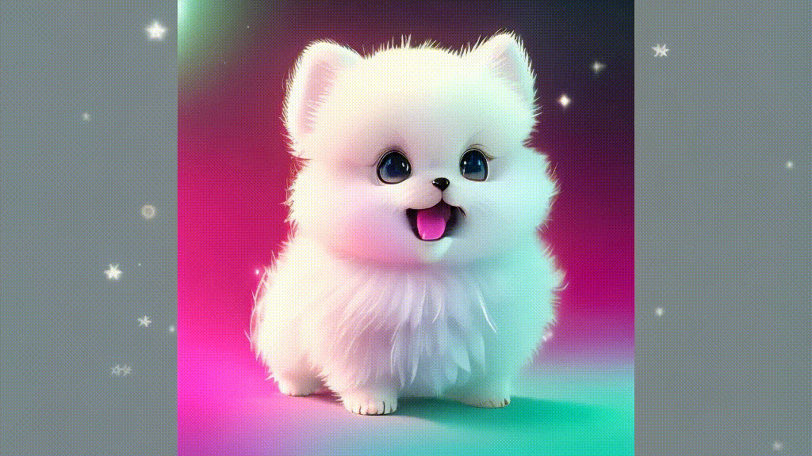

# 针对游戏形象图+文生视频模型调研报告

​                                                                                                                                                                                                         孙志强

---

## 1、引言

### 1.1 背景及目标

​       近年来，随着人工智能技术的发展，基于AI的内容生成在游戏开发、影视制作和虚拟现实等领域得到了广泛应用。为了增强用户体验并提高内容制作效率，游戏开发者需要一种能够将静态游戏形象和文字描述转换为一致动作视频的技术解决方案。本文档通过调研现有的开源和商用解决方案，找到最佳实践，帮助游戏开发团队实现这一需求。

### 1.2 意义

针对静态游戏角色图片生成形象一致的动作视频有以下几方面的重要意义：

+ **提高内容创作效率**：通过自动化生成视频内容，可以显著减少人工制作的时间和成本。
+ **增强用户体验**：动态视频比静态图像更具表现力，能够更好地展示游戏角色的特性和行为。
+ **个性化内容生成**：根据用户的描述生成特定动作视频，可以实现高度个性化的内容，提升用户满意度。
+ **丰富互动方式**：在游戏中引入动态视频内容，可以增加游戏的互动性和趣味性，吸引更多用户。

## 2、Stable Diffusion、Sora等文生图视频大模型原理简单原理

​     由于之前未有SD模型等相关技术的基础知识，因为在调研目前主流可用模型项目之前先阐述基础的相关原理，以提高后续调研的效率及科学性、有效性。

### 2.1  基础技术及概念

| 名称      | 概念                                      | 年份 |
| --------- | ----------------------------------------- | ---- |
| Sora      | OpenAI的视觉大模型                        | 2023 |
| Diffusion | 扩散器技术                                | 2015 |
| DDPM      | Denoising Diffusion Probabilistic Models  | 2020 |
| U-Net     | 一种DDPM模型                              | 2020 |
| VIT       | Vision Transformer 为了图像识别           | 2020 |
| DIT       | Diffusion Transformer为了图像生成         | 2023 |
| VAE       | Variant Auto Encoder 一个升降维的概率模型 | 2013 |
| CLIP      | Contrastive Language-lmage Pre-training   | 2021 |
| Gaussian  | 高斯分布                                  |      |
| LDM       | Latent Diffusion Models                   |      |

+ Diffusion模型是深度学习领域中一种用于生成数据的模型，它的基本原理是通过一个逐渐去噪的过程从随机噪声生成清晰的图像或其他数据。
+ DDPM：DDPM模型的核心思想是通过逐步去噪来生成数据
+ VIT由Google Research团队在2020年提出，ViT在图像分类任务中取得了显著的效果，尤其是在有大量数据进行预训练的情况下。
+ DiT (Diffusion Transformer) 是一种结合扩散模型和Transformer架构的生成模型，主要用于高质量图像生成任务。DiT利用Transformer的强大建模能力和扩散模型的逐步去噪过程，能够生成具有丰富细节和高分辨率的图像。DIT借助了VIT的架构，融合了diffusion
+ VAE：自动编码解码器
+ CLIP：训练图像和文字关联度
+ Gaussian:用于Diffusion中生成噪音的时候会用到
+ LDM：潜在空间---降维

### 2.2 Stable Diffusion早期架构

+ CLIP model: 典型的transformer语言模型(Contrastive Language-lmage Pre-training），CLIP是在大量“像素图片+文字标签”的数据集上训练的,故可将文字token与像素token合并在一个向量空间中计算近似度。
+ VAE encoder/ VAE decoder (Varigtional Auto Encoder)，编码器:将复杂的高维数据(如图像、音频)表示为低维的向量，其输出的是一个概率分布(高斯分布)的参数(均值和方差)；解码器:从低维向量空间中采样点并将其映射回高维数据空间。
+ Latent Space: 潜在子空间，或叫图像信息空间；Pixel space: 像素空间 (latent space计算量比老版的difusion的pixel space要小很多)

其中的Latent Space降维过程

图片信息处理，即训练过程： 分为（1）前向扩散过程（Forward Diffusion Process）→图片中添加噪声；（2）反向扩散过程（Reverse Diffusion Process）→去除图片中的噪声。

### 2.3 领头羊Sora的 架构

​      Sora 是一种改进的图像生成模型，与 Stable Diffusion 关键的区别在于图片信息处理部分将原来的 UNet 模型换成了 **Transformer**。Sora 的架构设计使其在训练效率和生成效果方面更具优势。

1. **Transformer**:
   - **Patch Embedding**: 输入的图像首先被分解成一个个固定大小的 Patch（例如 32x32）。每个 Patch 都被嵌入到一个高维向量空间中。
   - **Position Embedding**: 由于 Transformer 不具备处理位置信息的能力，Sora 在每个 Patch 的嵌入向量中添加了位置信息。这样，模型可以恢复图像中各个 Patch 的空间关系。
   - **Self-Attention Mechanism**: Transformer 的核心是自注意力机制，它可以捕捉图像中不同部分之间的长距离依赖关系。这使得模型能够生成更具一致性和细节丰富的图像。

而快手的可灵大模型，其前三个特点就是Sora的技术特点。

​		因此，需要着重学习其中的DIT技术。其中有一篇Google发的论文：Scalable Diffusion Models with Transformershttps://arxiv.org/pdf/2212.09748.pdf就是关于此技术。

​		从上面可以知道，大部分的扩散模型都是采用U-net主干网络，而这篇提出使用Transformers替换扩散模型中U-Net主干网络，称为Diffusion Transformers(DiT)，还探究了transformer架构在扩散模型上的scalability能力，从网络复杂度和采样质量两个方面对DiTs方法进行评估。 分析发现，这种 DiT 不仅速度更快(更高的Gflops，衡量模型架构的复杂度)，而且在lmageNet512x512和256x256的类别条件图片生成任务上，取得了更好的效果，256x256上实现了SOTA的FID指标。

#### Preliminaries-扩散模型

​		扩散模型的训练可以分为两个部分:
(1)前向扩散过程(Forward Diffusion Process): 将前向加噪声过程分为离散的多个时间步T在每一个时间步t，给上一个时间步t-1的数据x添加高斯噪声，从而生成带噪数据 x，这一过程不需训练/
(2)反向扩散过程(Reverse Diffusion Process):去除图片中的噪声。使用t步的结果作为条件输入预测 t-1步增加的噪声，然后使用DDPM可以得到t-1步的分布。DiT所使用的扩散模型沿用了OpenAl的Improved DDPMZ:$$p_\theta(x_{t-1}|x_t) = \mathcal{N}(\mu_\theta(x_t),\Sigma_\theta(x_t))$$

首先使用简单的损失函数 $$\mathcal{L}_{simple}$$训练噪声预测网络$$\epsilon_{\mathrm{e}}$$:$$\mathcal{L}_{simple}(\theta)=||\epsilon_\theta(x_t)-\epsilon_t||_2^2$$

然后再使用完整的损失函数训练:$$\mathcal{L}(\theta) = -p(x_{0}|x_{1}) +\sum_{t}\mathcal{D}_{KL}(q^{*}(x_{t-1}|x_{t},x_{0})||p_{\theta}(x_{t-1}|x_{t}))$$

#### Preliminaries-潜在扩散模型

​		在高分辨率像素空间直接训练扩散模型可能计算上代价过高。潜在扩散模型(Latent DiffusionModels，LDM)可以避免直接在高维像素空间中进行训练，减少了计算成本和型复杂性，同时提高了训练的效率LDM 通过两阶段方法解决了这个问题:(1)学习一个自编码器，用学习的编码器 E 将高维的图像x压缩成低纬的潜在表示 z，z=E(x);(2)训练一个扩散模型来处理表示z，而不是图像x(编码器E是冻结的)。然后，通过从扩散模型中采样表示z来生成新的图像，使用学习的解码器 D解码为图像 x，x=D(z)。作者将DiTs应用到了潜在空间。

#### Patchify

- 把输入变成patch，patch size用pxp表示。
- 经过patchify层，把 patch 变成一系列 tokens。
- p直接决定了tokens的数量，进而影响模型的Gflops。
- 文章采用超参p=2，4，8进行对比实验。

#### DIT Block

+ 对于扩散模型来说，有时候还要处理附加的条件信息，比如噪声时间步长t、类标签c、自然语言等。
+ **In-context conditioning**:把条件信息t和c作为额外的token拼接到DiT的input token中
+ **Cross-attention block**:将t和c的embeddings 拼接起来，然后再插入一个cross attention，条件embeddings作为cross attention的key和value;这种方式需要额外引入15%的Gflops。

+ **Adaptivelayer norm(adaLN)block**:使用adaLN替换原生Layer Norm
+ **adaLN-Zero block**:将adaLN的Batch Normalization层参数初始化为zero。除了在LN之后回归scale和shift，还在每个残差模块结束之前回归一个scale。adaLNZero为模型添加了可以忽略不计的Gfops。
+ 在最后一个DiT块之后，需要将图像token序列解码，输出噪声预测和协方差预测。

## 3、目前最好的主流商用项目（游戏形象图+字--->视频）

### 3.1 Runway Gen-3 Alpha

**网址**：[Gen-3 Alpha | Runway (runwayml.com)](https://runwayml.com/ai-tools/gen-3-alpha/)

**费用**：$12/月，\$144/年

+  公司名称和简介

​       Runway是一家专注于通过人工智能技术实现内容创作自动化的公司。成立于2018年，Runway提供了一系列基于机器学习的工具，旨在简化和加速视频编辑、图像生成和其他创意工作流程。

​       从年初OpenAI的Sora开始，Vidu、LTX、可灵、Luma等等AI视频应用参与者，轮番炸场抛出新的视频工具（美图也在7月底会推出AI视频工具MOKI），而Runway自从去年11月份更新了一次Gen2后再无动静，很多人都以为Runway要被时代淘汰的时候，Runway发布了震撼视频，宣告了它作为AI视频领域顶级玩家的存在感。相较于前一代Gen-2，Gen-3在视频生成的质量、色彩、饱和度、光影效果、文本语义还原、镜头运动、动作一致性及场景切换等方面均有显著提升。

+  主要特点及创新点
  1. **生成速度快**：可以支持在90秒内生成10秒的视频并且可以并行生成多个视频。对于游戏开发者来说，这种速度意味着可以迅速生成和测试角色动画，缩短开发周期，提高工作效率。
  2. **更写实，表现力更强**：Gen3能够生成接近真实世界质量的视频内容，写实性更强。它擅长生成具有各种动作、手势及情绪。这对于游戏开发中的角色动画尤为重要，因为逼真的动作和情绪可以显著增强游戏角色的生命力和用户体验。通过输入静态图像和文字描述，系统能够生成符合描述的高质量动作视频，满足项目对视觉效果和表现力的高要求。
  3. **更加精细的动作控制**：Gen3是被描述精细时间密集的描述词训练而成的。游戏开发者可以通过详细描述角色的动作和情绪，生成精确匹配这些描述的视频内容。无论是复杂的战斗动作，还是细微的表情变化，其都能准确捕捉并再现，使得生成的视频更加生动和真实。

### 3.2 Luma AI Dream Machine

**网址**：[Luma Dream Machine (lumalabs.ai)](https://lumalabs.ai/dream-machine)

**费用**：Standard: \$29.99/月，可生成120段视频；Pro: \$99.99/月，可生成400段视频；Premier: \$499.99/月，可生成2000段视频；Free: 每月可生成30段视频。

+ 公司名称和简介

​		Luma AI，这是一家成立于 2021 年 9 月的美国加州公司，专注于 3D 内容生成技术。该公司的核心技术是 NeRF（Neural Radiance Fields），这是一种三维重建技术，可以通过少量照片生成、着色和渲染逼真的 3D 模型。

​		Luma 推出的 Dream Machine 基于 DiT 视频生成架构，能够在 120 秒内生成一个包含 120 帧的高质量视频，实现快速创意迭代。它能理解物理交互，确保生成的视频角色和场景具有一致性和物理准确性。

+ 主要特点及创新点

  1. **非常快**，120 秒生成 120 帧，得益于帧率的巨大提升，视频更加丝滑顺畅
  2. **动作非常逼真、连贯**；可以实现电影级的运镜效果，画面随着镜头运动，仍然保持画面的流畅和自然。
  3. **角色一致性极强**，能够模拟物理世界，Dream Machine 的新架构，让它能理解人、动物、物体在物理世界的交互。对于镜头人物，不同角度的变换，也能更好的保持形象不变。这种强大的角色一致性对于游戏开发者和动画制作者来说尤为重要，因为它确保了角色在各种动态场景中的连贯性和真实感，大大增强了用户的沉浸体验。
  4. **运镜非常自然**，完美匹配场景情感，能够生成流畅动态镜头，视觉体验大幅改善，AI 视频故事性表现力更强，打造影视级体验。

  

### 3.3 可灵

**网址**：[可灵大模型 (kuaishou.com)](https://kling.kuaishou.com/)

**费用**：三档会员价格分别为66元、266元和666元，对应分别获得660、3000 、8000“灵感值”，可生成约66个、300个或800个标准视频。

​		可灵大模型（Kling）是由快手大模型团队自研打造的视频生成大模型，具备强大的视频生成能力 让用户可以轻松高效地完成艺术视频创作。

- 主要特点及创新点
  1. 大幅度的**合理运动**:可灵采用3D时空联合注意力机制，能够更好地建模复杂时空运动，生成较大幅度运动的视频内容，同时能够符合运动规律。这意味着系统不仅能够生成简单的动作，还能模拟符合运动规律的复杂动态场景。这对于游戏开发和影视制作中的高动态动作场景尤为重要，能够显著提升生成内容的真实性和视觉效果。
  2. **长达2分钟**的视频生成:得益于高效的训练基础设施、极致的推理优化和可扩展的基础架构，可灵大模型能够生成长达2分钟的视频，且帧率达到30fps。
  3. **模拟物理世界特性**:基于自研模型架构及Scaling Law激发出的强大建模能力，可灵能够模拟真实世界的物理特性，生成符合物理规律的视频。无论是人物的重心移动、物体的自由落体还是液体的流动，系统都能逼真再现。这种能力使得生成的视频不仅视觉上真实，还能在物理层面上符合实际，这对于科学可视化和物理模拟类项目具有重要意义。
  4. **强大的概念组合能力**:基于对文本-视频语义的深刻理解和 Diffusion Transformer 架构的强大能力，可灵能够将用户丰富的想象力转化为具体的画面，虚构真实世界中不会出现的的场景。

### 3.4  Viggle --全球首个引入真实物理感知的文生视频模型

[VIGGLE](https://www.viggle.ai/?utm_source=usbot)

​		Viggle是全球首个具有实际物理感知能力的文生视频模型，旨在简化动画流程，提高用户创建动画角色视频效率。该模型基于JST-1模型打造，生成的视频不仅看起来真实，而且角色的动作和互动都符合实际物理规律。

**三维时空联合注意力机制**：

- 通过引入三维时空联合注意力机制，Viggle能够更好地建模复杂的时空运动，从而生成较大幅度运动的视频内容，符合真实世界的运动规律。

**高效的训练基础设施**：

- Viggle的训练基础设施经过优化，能够处理大规模数据集，提升模型的训练效率。通过有效利用计算资源，Viggle可以在较短的时间内完成大规模视频的生成。

**极致的推理优化**：

- 为了提高推理速度和生成效率，Viggle进行了多方面的优化，包括模型结构优化、硬件加速等，使得模型在生成视频时能够达到更高的帧率和更低的延迟。

**扩展性强的架构**：

- Viggle的架构设计具有高度的扩展性，能够支持多种输入形式（如静态图像和文字描述）并生成符合需求的视频内容。此外，架构的模块化设计使得其可以与其他系统和工具进行良好的集成。

**物理世界特性的模拟**：

- Viggle具备模拟真实世界物理特性的能力，生成的视频不仅在视觉上逼真，而且符合物理规律。这使得生成的动画内容更加自然和可信。

**概念组合能力**：

- 通过深刻理解文本和视频语义，Viggle能够将用户的想象力转化为具体的画面，生成虚构但符合逻辑的场景。这种能力使得Viggle在生成创意内容时具有极大的优势。

## 4、目前最好的主流开源项目（游戏形象图+字--->视频）

### 4.1 Open-Sora(⭐20.9k)

[hpcaitech/Open-Sora: Open-Sora: Democratizing Efficient Video Production for All (github.com)](https://github.com/hpcaitech/Open-Sora)

​		国产技术团队Colossal-Al开源了视频生成模型Open-Sora1.0,该模型继承并超越了OpenAl Sora的优异视频生成效果，通过提供一个低成本且高效的训练及推理复现流程，极大降低了技术门槛。 

- ​	**架构及技术特点**

  - **Diffusion Transformer (DiT) 模型**：结合时间注意力层，优化对视频数据的处理。

  - **预训练的VAE和文本编码器**：实现高效的空间布局和时间序列关联学习。

  - **空间-时间注意力机制**：进一步提升视频生成的效率和质量。

  - **多阶段训练策略**：包括大规模图像预训练、视频预训练及高质量视频数据的微调，提升生成视频的细节和质量。

+ **对项目的帮助**

  - **低成本高效训练及推理**： Open-Sora提供了一个低成本且高效的训练和推理流程，这对需要快速生成和迭代视频内容的项目非常有帮助。通过这种高效的流程，能够在较短时间内生成高质量的视频内容，适合你的项目需求。

  - **Diffusion Transformer (DiT) 模型**： 采用的DiT模型结合时间注意力层，能够优化对视频数据的处理，这对于生成流畅且高质量的动作视频非常关键。你的项目需要将静态图像和文字描述转化为一致的动作视频，DiT模型的高效处理能力可以提升视频生成的效果和连贯性。

  - **预训练的VAE和文本编码器**： 利用预训练的VAE和文本编码器，Open-Sora能够实现高效的空间布局和时间序列关联学习。这意味着在输入静态图像和文字描述后，系统能够更好地理解和生成符合描述的动作视频，确保生成内容的准确性和一致性。

  - **多阶段训练策略**： Open-Sora通过大规模图像预训练、视频预训练及高质量视频数据的微调，显著提升了视频生成的细节和质量。这对于你的项目来说，意味着生成的视频不仅质量高，而且细节丰富，更符合实际需求。

  - **空间-时间注意力机制**： 该机制能够有效提升视频生成的效率和质量，确保在处理复杂的动态场景时，视频内容依然保持高质量和连贯性。这对于生成形象一致的动作视频尤为重要，能够增强视频的视觉效果和用户体验。

.gif)

### 4.2  Stable Video Diffusion (⭐23.5k)

https://github.com/Stability-AI/generative-models 

​	Stable Video Diffusion是Stability Al发布的视频生成大模型。

+ **架构及技术特点**

  - **多阶段训练策略**： 包括文本到图像的预训练、视频预训练以及高质量视频的微调。这种分阶段的训练方法使得模型能够逐步学习从文本到图像，再到视频的复杂映射关系，从而提高生成视频的质量和准确性。

  - **多视图3D先验和运动表征能力**： 提供强大的多视图3D先验和运动表征能力，广泛应用于文本到视频、图像到视频的生成，以及对摄像机运动特定的适应性。该模型能够以前馈方式生成对象的多个视图，算力需求较小，且性能优于传统的图像方法。

  - **高质量、动作连贯且时间一致的视频生成**： 通过多阶段的训练策略和精心准备的数据集，Stable Video Diffusion能够生成高质量、动作连贯且时间一致的视频内容。

    

+ **对项目的帮助**

  - **多阶段训练策略**： 该策略使模型能够更好地理解并生成从文本到图像，再到视频的复杂映射关系。对于你的项目，这意味着模型可以更准确地将静态图像和文字描述转换为一致的动作视频，确保生成内容的准确性和连贯性。
  
  - **多视图3D先验和运动表征能力**： 该模型具有强大的多视图3D先验和运动表征能力，能够处理复杂的动态场景，并生成多个视图的对象。这对于生成高质量且连贯的动作视频非常重要，特别是在需要不同角度和视角变化的场景中，能够确保视频内容的连续性和一致性。
  
  - **低算力需求**： Stable Video Diffusion相较于传统基于图像的方法，具有较小的算力需求。这意味着在硬件资源有限的情况下，依然能够高效地生成高质量的视频内容，降低了项目实施的硬件成本。
  
  - **高质量、动作连贯且时间一致的视频生成**： 该模型通过精心准备的数据集和多阶段的训练策略，能够生成高质量、动作连贯且时间一致的视频内容。对于你的项目，这种特性确保了生成的视频不仅视觉上逼真，而且在动作和时间序列上连贯一致，提升了用户的观看体验和内容的真实性。
  
    
  

### 4.3 AnimateDiff (⭐9.9k)

https://github.com/guoyww/animatediff 

​		AnimateDiff是由上海人工智能实验室、香港中文大学和斯坦福大学的研究人员推出的一款框架，用于将个性化的文本到图像模型扩展为动画生成器。其核心在于利用从大规模视频数据集中学习到的运动先验知识，可以作为Stable Diffusion文生图模型的插件，允许用户将静态图像转换为动态动画。

- #### 架构及技术特点

  - **运动先验知识**： AnimateDiff利用从大规模视频数据集中学习到的运动先验知识，能够生成连贯的动态动画。这种先验知识帮助模型更好地理解和生成符合实际运动规律的动画内容。

  - **文本描述控制**： 该框架允许用户通过文本描述来控制动画的内容和风格，而无需进行特定的模型调优。用户可以根据需求，输入详细的文本描述来生成符合预期的动画效果。

  - **插件化设计**： AnimateDiff可以作为Stable Diffusion文生图模型的插件使用，使得已有的图像生成模型能够扩展为动画生成器。这种插件化设计简化了动画生成的过程，使得用户无需重新训练模型即可生成动态动画。

- #### 对项目的帮助

  - **利用运动先验知识**： AnimateDiff利用从大规模视频数据集中学习到的运动先验知识，能够生成连贯的动态动画。对于你的项目，这意味着模型可以更好地理解和生成符合实际运动规律的动作视频，从而提升生成内容的真实感和连贯性。

  - **文本描述控制**： 该框架允许通过文本描述来控制动画的内容和风格，非常适合你的项目需求。你可以输入静态图像和详细的文字描述，生成符合描述的动作视频，而无需进行复杂的模型调优，简化了操作流程。

  - **插件化设计**： AnimateDiff作为Stable Diffusion文生图模型的插件，使得你可以在已有的图像生成模型基础上，扩展为动画生成器。这种插件化设计不仅简化了动画生成的过程，还降低了项目的技术门槛，使得生成动态动画更加便捷高效。

### 4.4 Animate Anyone (⭐14.2k)

https://github.com/HumanAIGC/AnimateAnyone

论文地址：[CVPR 2024 Open Access Repository (thecvf.com)](https://openaccess.thecvf.com/content/CVPR2024/html/Hu_Animate_Anyone_Consistent_and_Controllable_Image-to-Video_Synthesis_for_Character_Animation_CVPR_2024_paper.html)

Animate Anyone是阿里巴巴旗下研究院发布的动画制作Al软件。能够自动生成角色、场景、动作等动画元素，并将其组合成完美动画作品，用户只需提供一些简单的参数即可。这大大降低了动画制作的难度，让动画制作变得更加简单。 

- **ReferenceNet 模块**：用来捕捉参考图像中的细节特征，以确保在动画生成过程中，角色的外观一致性和细节保留。

- **Pose Guider**：轻量级的姿势引导器，用于控制角色动作，实现动画的时空一致性和自然流畅的运动效果。

- **增强的稳定扩散模型**：修改后的稳定扩散模型能更好地处理图像到视频的转换，尤其是在保持角色细节和动作一致性方面。

- **丰富的动画控制功能**：用户可以通过简单的文本描述控制动画内容和风格，无需进行复杂的模型调优。

## 5、模型对比实际效果

为了对比各种模型的实际效果，我对目前市面上能试用的比较好的模型进行实验对比。

### （1）A cute cartoon dog 

prompt：A cute cartoon dog opens its mouth and shakes its head."

|          名称          |        生成时间        |                            效果图                            |
| :--------------------: | :--------------------: | :----------------------------------------------------------: |
|      Runway Gen2       |         50-70s         |  |
|      Runway Gen3       |                        |                      目前不支持图生视频                      |
|   Luma Dream machine   |         2-3min         |  |
|        快手可灵        |         5-7min         |  |
|        抖音即梦        |         2-3min         |  |
|         Viggle         |  仅适用于人的动作生成  |                                                              |
|       open sora        |         2-4min         |  |
| Stable Video Diffusion | 1min（但不可加prompt） |  |
|     AnimateAnyone      |         2-3min         |  |
|          Pika          |          1min          |  |
|         hipar          |         1-2min         |  |
|      智谱AI-清影       |         1-2min         |  |
|     DynamiCrafter      |         1-2min         |  |

### （2）A cute capybara (2D)

prompt： A cute capybara wiggles its ears back and forth

|                        |        生成时间         |                            效果图                            |
| :--------------------: | :---------------------: | :----------------------------------------------------------: |
|      Runway Gen2       |         50-70s          |  |
|      Runway Gen3       |                         |                      目前不支持图生视频                      |
|   Luma Dream machine   |         2-3min          |  |
|        快手可灵        |         5-7min          |  |
|        抖音即梦        |         2-3min          |  |
|         Viggle         |  仅适用于人的动作生成   |                                                              |
|       open sora        |         2-4min          |  |
| Stable Video Diffusion | 1min（但不可加prompt）  |  |
|     AnimateAnyone      | 适用于图片+人的骨骼动作 |  |
|          Pika          |          1min           |  |
|         hipar          |         1-2min          |  |
|      智谱AI-清影       |         1-2min          |  |
|     DynamiCrafter      |         1-2min          |  |

### (3) 总结

​		我使用了两种不同类型的卡通图，一种是3D的，一种是2D的，从整体效果对比下来，从整体合理性、任务完成度、生成时间三个指标进行评判，每个指标满分为5分，得出以下结果。

| 名称                   | 整体合理性 | 任务完成度 | 生成时间 | 总分 |
| ---------------------- | ---------- | ---------- | -------- | ---- |
| runway gen2            | 3          | 3          | 4        | 10   |
| Luma Dream machine     | 4          | 4          | 3        | 11   |
| 快手可灵               | 3          | 3          | 1        | 7    |
| 抖音即梦               | 3          | 3          | 2        | 8    |
| open sora              | 2          | 1          | 2        | 5    |
| Stable Video Diffusion | 2          | 2          | 3        | 7    |
| Animate Anyone         | 4          | 3          | 2        | 9    |
| Pika                   | 2          | 1          | 3        | 6    |
| hipar                  | 2          | 2          | 3        | 7    |
| 清影                   | 2          | 3          | 3        | 8    |
| DynamiCrafter          | 2          | 2          | 3        | 7    |

​		从上表中可以看出，对于这种卡通非人型图来看，runway gen2和Luma Dream machine总体效果是最好的，如果runway的gen3也出了图生视频的功能的话，效果应该能进一步提升。在整体合理性来看，其实可灵和即梦这两大国产AI表现的也很不错。其中，在3D图片就是第一个图中，Luma Dream machine的表现几乎是独一档最好的，这得益于其公司的特色核心技术： NeRF（Neural Radiance Fields），这是一种三维重建技术，可以通过少量照片生成、着色和渲染逼真的 3D 模型。也就是这种技术让3D小狗运动得格外真是。而对于2D图片来说，runway gen2算是表现的更好的一方，不仅在生成速度上更快，对于其表现力、生动性也更强。

​		在开源中的这几种技术，Stable Video Diffusion作为最多star，最受欢迎的，其表现也可圈可点。在3D图片，虽然不能加prompt，但是其展现出现生动性和表现力还是比较强的。对于open-sora，感觉生成出来的效果不是很理想，虽然生成的对应生物是正确的，但是并不符合prompt描述的。对于Animate Anyone，其已经部署在通义千问APP，可以通过app来使用这个模型，虽然其特色是生成舞蹈，但是这次的效果也很理想，整体的画面很完整不是很夸张，生动性和合理性也比较好，相对于其他的模型来说有一定的优势。

​		对于所有的模型来说，有部分可能在第一次生成比较抽搐，但是随着生成次数增加，生成的视频也更加合理、逼真。对于想要更好的效果可以调节一些参数。下图是一部分可调节参数。

| 序号 | 名称                       | 作用                                                         | 建议                                                         |
| ---- | -------------------------- | ------------------------------------------------------------ | ------------------------------------------------------------ |
| 1    | Seed (种子)                | 控制生成过程中的随机性。通过设置相同的种子值，可以保证每次生成的结果一致。这对于复现实验结果和生成一致的视频非常重要。 | 如果需要一致的结果，可以设置一个固定的种子值；如果需要多样性，可以每次使用不同的种子值。 |
| 2    | Sampling Steps (采样步骤)  | 控制生成过程中的迭代次数。更多的采样步骤通常会带来更高的生成质量，但也会增加计算时间。 | 一般情况下，采样步骤在 50-100 之间是一个合理的范围。可以根据具体需求调整，以找到质量和速度的平衡点。 |
| 3    | CFG Scale (分类引导系数)   | 控制生成过程中文本描述对生成图像的影响程度。较高的 CFG Scale 会使生成图像更贴合输入的文本描述，但也可能导致图像失真；较低的 CFG Scale 会使生成图像更加自然，但与文本描述的匹配度可能降低。 | 通常在 7.5-15 之间。可以通过实验找到一个合适的值。           |
| 4    | Motion Strength (运动强度) | 控制生成视频中运动的幅度和力度。较高的运动强度会生成更剧烈的运动，而较低的运动强度会生成较为平缓的运动 | 根据需要的视频效果调整。可以从中等值开始，然后根据生成结果进行微调。 |
| 5    | Aesthetic (美学评分)       | 控制生成视频的美学效果。较高的美学评分会使生成的视频更加符合美学标准，画面更加精美。 | 根据具体需求设置。如果需要高质量的美学效果，可以设置较高的值；如果注重生成速度，可以设置较低的值。 |
| 6    | Number of Loops (循环次数) | 控制生成视频的循环次数。较高的循环次数会生成更长的视频，并且视频内容会重复多次。 | 根据需要的视频长度和内容重复程度设置。如果只需要一次运动，可以设置为 1；如果需要更长的视频，可以增加循环次数。 |

+ 以DynamiCrafter模型为例调整参数验证效果。

  

  1. 当CFG   SCALE为7.5时，会使生成图像更贴合输入的文本描述，但也可能导致图像失真。

     

     

  2.  当CFG   SCALE为5时，会使图像更加自然，但是对文本描述的体验不多。

     

     

     3.当CFG   SCALE为15时。

     

  
